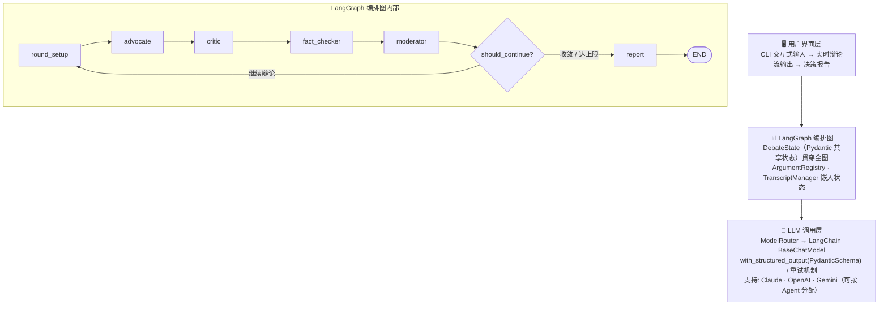
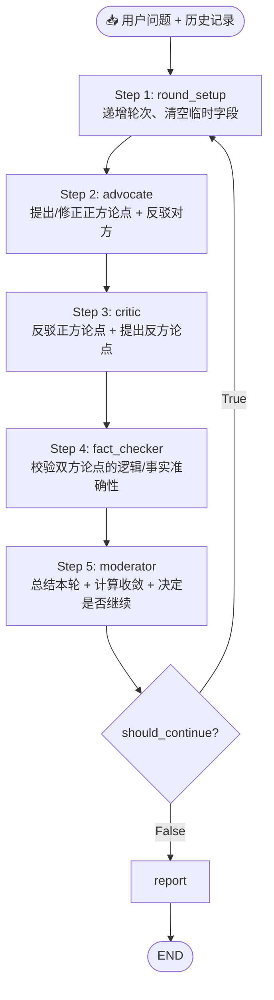
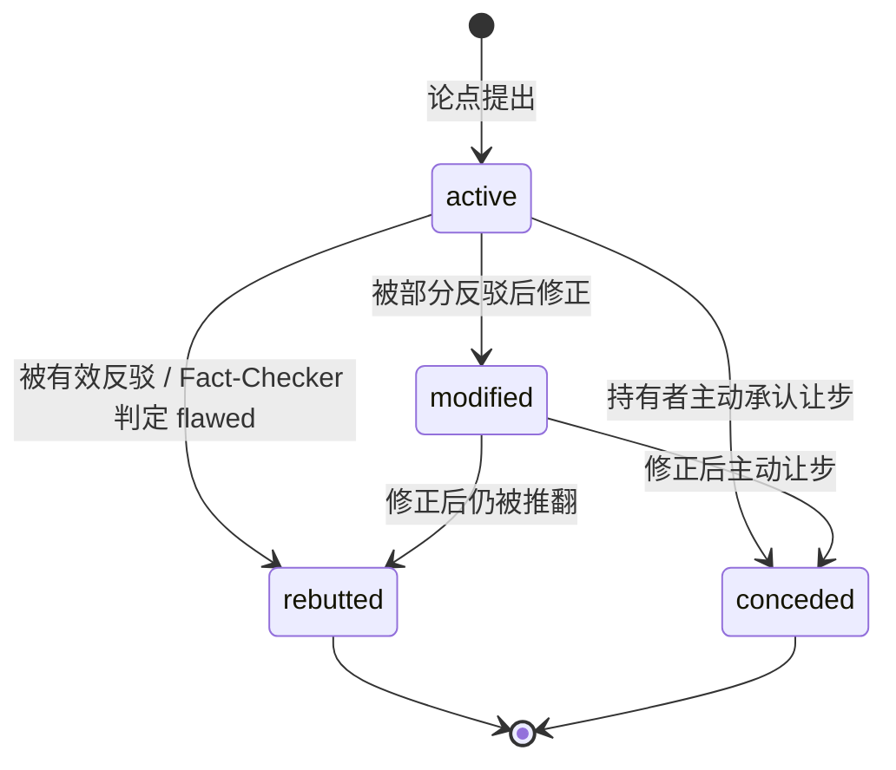

**中文** | [English](README_EN.md)

# 🏛️ Auto-Gangjing — 多 Agent 对抗式决策引擎

> 自动化杠精，对抗赛博精神病

[](https://www.python.org/)
[](https://langchain-ai.github.io/langgraph/)
[](https://www.anthropic.com/)
[](LICENSE)

---

## 目录

- [项目简介](#项目简介)
- [核心价值](#核心价值)
- [系统架构](#系统架构)
- [关键功能与实现细节](#关键功能与实现细节)
  - [1. 四 Agent 协作辩论系统](#1-四-agent-协作辩论系统)
  - [2. LangGraph 编排图](#2-langgraph-编排图)
  - [3. 论点注册与生命周期追踪](#3-论点注册与生命周期追踪)
  - [4. LLM 调用层与结构化输出](#4-llm-调用层与结构化输出)
  - [5. 多轮收敛判定机制](#5-多轮收敛判定机制)
  - [6. 决策报告生成](#6-决策报告生成)
  - [7. CLI 实时辩论流](#7-cli-实时辩论流)
- [项目结构](#项目结构)
- [快速开始](#快速开始)
- [配置说明](#配置说明)
- [使用方式](#使用方式)
- [输出效果](#输出效果)
- [依赖说明](#依赖说明)
- [测试](#测试)
- [成本估算](#成本估算)

---

## 项目简介

Auto-Gangjing 是一个基于多 Agent 协作的辩论式决策分析引擎。用户输入一个商业决策问题后，系统会启动 **4 个具有不同角色定位的 AI Agent**，通过多轮结构化辩论（正方论证 → 反方反驳 → 事实校验 → 主持人裁决），模拟真实的决策审议过程，最终输出一份包含正反论点、关键分歧、风险评估和行动建议的 **结构化决策报告**。

AI 可以用大量的知识去辅助人类的决策，但是不要让 AI 取代了你的思考。杠精的存在是为了尽可能消除 RLHF（Reinforcement learning from human feedback）对于人类的影响。

论文：Towards Understanding Sycophancy in Language Models (https://arxiv.org/abs/2310.13548)

整个系统基于 **Python 3.12+** 实现，以 **LangGraph** 构建有状态的多 Agent 编排图，通过 **LangChain Core** 统一抽象层支持 Claude / OpenAI / Gemini 多提供商，所有 Agent 输出由 **Pydantic v2** Schema 严格校验。

---

## 核心价值

**这不是简单的 pros/cons 列表。** 传统的 AI 问答只能给出单视角的分析，而本项目通过以下机制产出经过"压力测试"的高质量决策分析：

| 机制 | 说明 |
|------|------|
| 🔄 **动态对抗** | Critic 必须引用 Advocate 的具体论点 ID 进行反驳，而非"各说各话" |
| 📎 **证据引用** | 每个论点要求提供推理链和证据支撑，而非空泛断言 |
| 🤝 **立场修正** | Agent 必须诚实回应有效反驳，承认让步或修正论点 |
| ✅ **事实校验** | 中立的 Fact-Checker 审查双方论证的逻辑谬误和推理缺陷 |
| 📊 **收敛判定** | Moderator 实时计算收敛分数，在恰当时机终止辩论 |
| 📈 **论点生命周期** | 追踪每个论点从提出到存活/被推翻的完整历程 |

### 现实应用场景

这套对抗性分析框架并不局限于商业决策，以下是一些典型落地方向：

- **企业战略**：并购评估、市场进入时机判断、自建 vs. 采购技术选型（参见 `examples/build_vs_buy.py`）——让利益相关方在拍板前就看到最强反对声音。
- **投资尽调**：在 VC / PE 投决会之前，用辩论报告提前暴露标的公司的核心风险点，替代传统"只报喜不报忧"的 pitch deck 分析。
- **产品路线图**：PO 在季度规划中用它对每个潜在 Epic 进行压力测试，避免因团队内部共识偏差而忽视用户痛点或竞争威胁。
- **监管 & 合规**：新政策落地前，模拟监管方与业务方的对立立场，提前识别合规盲区或执行阻力。
- **个人重大决策**：职业转型、城市迁移、大额消费——在信息不完整时，用结构化辩论代替直觉拍脑袋，强迫自己直面最坏情景。
- **学术 & 教育**：模拟同行评审的质疑方，帮助研究者在投稿前发现论证漏洞；也可用于辩论课训练，生成高质量对立论点。
- **咨询 & 智库**：为客户战略报告生成"红队"（Red Team）视角，用可溯源的论点链替代顾问的主观判断。

> **核心原则**：任何需要在不确定信息下做出高代价、难逆转决策的场景，都可以从结构化对抗分析中获益。

---

## 系统架构



**数据流（单回合）：**



---

## 关键功能与实现细节

### 1. 四 Agent 协作辩论系统

系统包含 4 个角色明确的 AI Agent，每个 Agent 都继承自同一个 `BaseAgent` 抽象基类，通过 Pydantic v2 Schema 保证输入输出的类型安全。

#### Advocate Agent（正方论证者）

- **角色：** 资深商业战略顾问，负责构建最强的正方论证（"应该做"的方向）
- **行为规则：**
  - 第一轮独立提出 3-5 个核心正方论点，每个论点包含 `claim`（主张）、`reasoning`（推理过程）、`evidence`（支撑证据）
  - 后续轮次需回应 Critic 的反驳和 Fact-Checker 的校验结果
  - 对被有效反驳的论点执行让步（concessions）或修正（status: modified）
  - 对 Critic 的论点提出反驳（rebuttals），必须引用对方论点 ID（`target_argument_id`）
  - 禁止无视有效反驳、禁止重复已被推翻的论点
- **论点 ID 格式：** `ADV-R{轮次}-{序号}`，如 `ADV-R1-01`
- **实现文件：** `src/agents/advocate.py` + `src/prompts/advocate.py`

#### Critic Agent（反方批评者）

- **角色：** 严苛的风险分析师，系统性挑战正方论点
- **行为规则：**
  - 逐条审视 Advocate 论点，找出逻辑漏洞、隐含假设、缺失考量
  - 对每个需反驳的论点产出 `Rebuttal`，必须引用具体论点 ID
  - 同时提出独立的反方论点
  - 只有当正方论点确实无懈可击时才承认让步
  - 禁止诡辩和稻草人谬误，必须攻击对方的真实论点
- **论点 ID 格式：** `CRT-R{轮次}-{序号}`，如 `CRT-R1-01`
- **实现文件：** `src/agents/critic.py` + `src/prompts/critic.py`

#### Fact-Checker Agent（事实校验者）

- **角色：** 逻辑学教授，中立第三方
- **行为规则：**
  - 对本轮所有 `active` 状态的论点和反驳进行校验
  - 判定结果分四类：
    - `valid` — 逻辑自洽、推理合理
    - `flawed` — 存在逻辑谬误或推理错误（标记后自动转为 rebutted）
    - `needs_context` — 论点合理但缺少关键上下文
    - `unverifiable` — 无法在当前信息下判断对错
  - 如发现认知偏误（确认偏误、幸存者偏误等），明确指出
  - 不选边站，只评估论证质量
- **实现文件：** `src/agents/fact_checker.py` + `src/prompts/fact_checker.py`

#### Moderator Agent（主持人 / 收敛控制器）

- **角色：** 辩论主持人，控制节奏、判断收敛、引导焦点
- **行为规则：**
  - 每轮总结辩论进展（`round_summary`）
  - 识别当前关键未解决分歧（`key_divergences`）
  - 计算收敛分数（`convergence_score`，0-1）
  - 决定是否继续辩论（`should_continue`）
  - 给出下一轮焦点引导（`guidance_for_next_round`）
- **实现文件：** `src/agents/moderator.py` + `src/prompts/moderator.py`

#### Agent 基类设计

所有 Agent 继承自 `BaseAgent` 抽象基类（`src/agents/base.py`），统一实现：

```python
class BaseAgent(ABC):
    MAX_RETRIES = 2

    async def invoke(
        self,
        system_prompt: str,
        user_message: str,
        output_schema: type[BaseModel],
    ) -> BaseModel: ...
```

`invoke()` 方法内置 **Pydantic 校验失败自动重试**：当 LLM 输出无法解析为合法 Schema 时，自动追加纠错消息要求 LLM 重新格式化，最多重试 2 次。

---

### 2. LangGraph 编排图

核心编排逻辑位于 `src/graph/builder.py` 中的 `build_debate_graph()` 函数，基于 **LangGraph `StateGraph`** 构建有向循环图。

**图结构：**

```python
graph.add_node("round_setup", round_setup_node)
graph.add_node("advocate",    partial(advocate_node,    router=router))
graph.add_node("critic",      partial(critic_node,      router=router))
graph.add_node("fact_checker",partial(fact_checker_node,router=router))
graph.add_node("moderator",   partial(moderator_node,   router=router))
graph.add_node("report",      partial(report_node,      router=router))

graph.add_edge("round_setup",  "advocate")
graph.add_edge("advocate",     "critic")
graph.add_edge("critic",       "fact_checker")
graph.add_edge("fact_checker", "moderator")
graph.add_conditional_edges(
    "moderator",
    should_continue,
    {"continue": "round_setup", "end": "report"},
)
graph.add_edge("report", END)
```

**收敛条件（`src/graph/conditions.py`）：**

| 终止条件 | 判定逻辑 |
|---------|---------|
| **Moderator 主动终止** | `should_continue=False` + `convergence_score ≥ 0.8` |
| **连续高收敛** | 连续 2 轮 `convergence_score ≥ 0.8`，即使 Moderator 仍想继续 |
| **达到最大轮数** | `current_round >= config.max_rounds` |
| **错误状态** | `state.status == DebateStatus.ERROR` |

每次终止都记录 `state.convergence_reason`，报告中可见原因。

---

### 3. 论点注册与生命周期追踪

`ArgumentRegistry`（`src/core/argument_registry.py`）是全局论点追踪器，维护每个论点从提出到最终状态的完整生命周期。以字典形式嵌入 `DebateState`，随 LangGraph 状态传递，无需外部存储。

**核心数据结构（Pydantic）：**

```python
class ArgumentRecord(BaseModel):
    argument: Argument
    raised_in_round: int
    raised_by: Literal["advocate", "critic"]
    rebuttals: list[Rebuttal] = []
    fact_checks: list[FactCheck] = []
```

**论点状态流转：**



**关键方法：**

| 方法 | 功能 |
|------|------|
| `register(arg, round, agent)` | 注册新论点 |
| `add_rebuttal(target_id, rebuttal)` | 记录对论点的反驳 |
| `add_fact_check(target_id, check)` | 记录事实校验结果，flawed 自动标记为 rebutted |
| `get_active_arguments(side=None)` | 获取所有存活论点（active + modified） |
| `get_survivor_stats()` | 获取论点存活统计 |

---

### 4. LLM 调用层与结构化输出

#### ModelRouter（`src/llm/router.py`）

- 基于 **LangChain Core `BaseChatModel`** 统一抽象，支持按 Agent 角色分配不同 LLM
- `get_structured_model(role, schema)` 调用 **`model.with_structured_output(PydanticSchema)`**，由 LangChain 负责解析和重试
- 支持 `model.with_fallbacks([backup_model])` 配置备用模型

```python
# 按角色分配不同模型
router.get_model("advocate")      # → ChatAnthropic / ChatOpenAI / ChatGoogleGenerativeAI
router.get_structured_model("fact_checker", FactCheckResponse)
```

#### 多提供商支持（`src/llm/factory.py`）

| provider 字段 | 实例化类 |
|-------------|---------|
| `claude` | `ChatAnthropic` |
| `openai` | `ChatOpenAI` |
| `gemini` | `ChatGoogleGenerativeAI` |

#### 结构化输出 Schema（`src/schemas/`）

所有 Agent 输出都由 Pydantic v2 Schema 严格校验：

| Schema | 校验内容 |
|--------|---------|
| `AgentResponse` | Advocate / Critic 的输出（论点、反驳、让步、信心变化） |
| `FactCheckResponse` | Fact-Checker 的校验结果 |
| `ModeratorResponse` | Moderator 的裁决（收敛分数、是否继续等） |
| `DecisionReport` | 最终决策报告 |

所有数值字段都包含范围约束（如 `confidence_shift: float` 限制在 [-1, 1]，`convergence_score: float` 限制在 [0, 1]，`strength: int` 限制在 [1, 10]）。

---

### 5. 多轮收敛判定机制

辩论不会无限进行，系统实现了**四重收敛保障**：

| 终止条件 | 判定逻辑 | 优先级 |
|---------|---------|--------|
| **Moderator 主动终止** | Moderator 在 prompt 中被指导计算收敛分数，当分数 ≥ 0.8 且辩论趋于稳定时设置 `should_continue=False` | 最高 |
| **连续高收敛** | 即使 Moderator 想继续，若连续 2 轮 `convergence_score ≥ 0.8`，条件边强制终止 | 高 |
| **强制轮次上限** | 达到 `max_rounds` 后强制终止 | 中 |
| **错误状态** | `state.status == ERROR` 立即终止 | 兜底 |

**收敛分数计算依据（由 Moderator Agent 评估）：**
- 双方新论点数量是否递减
- 让步（concessions）是否增加
- 关键分歧是否在收窄
- 双方信心变化是否趋于 0

每次终止都在 `state.convergence_reason` 中记录原因，最终报告中可见。

---

### 6. 决策报告生成

辩论终止后，`report_node`（`src/graph/nodes/report.py`）调用一次独立 LLM 请求生成结构化 `DecisionReport`，再由 `render_report_to_markdown()`（`src/output/renderer.py`）渲染为 Markdown。

**报告内容包含：**

| 模块 | 说明 |
|------|------|
| **执行摘要** | 3-5 句话概括辩论结论 |
| **建议方向** | 包含方向、置信度（高/中/低）、前提条件 |
| **正方存活论点** | 按强度排序，包含经受挑战次数和修正历史 |
| **反方存活论点** | 同上 |
| **已解决分歧** | 辩论过程中双方达成共识的部分 |
| **未解决分歧** | 始终无法达成共识的核心问题 |
| **风险因素** | 关键风险提示 |
| **后续行动** | 基于未解决分歧建议的具体调研行动 |
| **辩论统计** | 总轮数、论点数、存活率、收敛原因 |

**Markdown 渲染特性：**
- 强度可视化条（`████████░░ 8/10`）
- 置信度色彩标记（🟢高/🟡中/🔴低）
- 执行时间和 Token 消耗统计
- 收敛原因说明

---

### 7. CLI 实时辩论流

`src/output/stream.py` 实现了终端彩色输出，通过 ANSI 转义码为不同 Agent 分配颜色，并通过 `app.astream()` 实现 LangGraph 状态变更的实时消费：

| Agent | 颜色 | 图标 |
|-------|------|------|
| Advocate（正方） | 🟢 绿色 | 🟢 |
| Critic（反方） | 🔴 红色 | 🔴 |
| Fact-Checker | 🟡 黄色 | 🟡 |
| Moderator | 🔵 青色 | 🔵 |

实时展示内容：
- 每轮分隔线和轮次编号
- 每个 Agent 的论点、反驳、让步和信心变化
- Fact-Checker 的校验结果（✅/❌/⚠️/❓ 图标）
- Moderator 的收敛进度条
- 辩论结束原因

---

## 项目结构

```
debate-engine-py/
├── .env.example                         # 环境变量模板（API Keys）
├── config.yaml                          # 主配置文件（模型、轮数等）
├── pyproject.toml                       # Python 包配置 + 依赖声明
│
├── src/
│   ├── main.py                          # CLI 入口 + run_debate() API
│   │
│   ├── schemas/                         # Pydantic v2 数据模型
│   │   ├── arguments.py                 #   Argument · Rebuttal · FactCheck · ArgumentRecord
│   │   ├── agents.py                    #   AgentResponse · FactCheckResponse · ModeratorResponse
│   │   ├── debate.py                    #   DebateState · DebateConfig · DebateRound · DebateMetadata
│   │   ├── report.py                    #   DecisionReport · ScoredArgument · Recommendation
│   │   └── config.py                    #   DebateEngineConfig · ModelAssignment
│   │
│   ├── llm/                             # LLM 调用层
│   │   ├── factory.py                   #   create_model() → Claude / OpenAI / Gemini
│   │   ├── router.py                    #   ModelRouter：按角色路由 + with_structured_output
│   │   └── cost.py                      #   MODEL_PRICING + calculate_cost()
│   │
│   ├── prompts/                         # Prompt 构造模块
│   │   ├── advocate.py                  #   round-aware System/User Prompt
│   │   ├── critic.py
│   │   ├── fact_checker.py
│   │   ├── moderator.py                 #   收敛评分锚点指导
│   │   └── report_generator.py
│   │
│   ├── agents/                          # Agent 实现
│   │   ├── base.py                      #   BaseAgent（MAX_RETRIES=2, Pydantic 重试）
│   │   ├── advocate.py
│   │   ├── critic.py
│   │   ├── fact_checker.py
│   │   └── moderator.py
│   │
│   ├── core/                            # 核心状态管理
│   │   ├── argument_registry.py         #   ArgumentRegistry：论点注册 + 生命周期
│   │   └── transcript_manager.py        #   TranscriptManager：历史压缩 + 上下文构建
│   │
│   ├── graph/                           # LangGraph 编排图
│   │   ├── builder.py                   #   build_debate_graph(router) → CompiledGraph
│   │   ├── conditions.py                #   should_continue() 条件函数
│   │   └── nodes/                       #   各 Agent 的异步 Node 函数
│   │       ├── advocate.py
│   │       ├── critic.py
│   │       ├── fact_checker.py
│   │       ├── moderator.py
│   │       └── report.py
│   │
│   ├── output/                          # 输出层
│   │   ├── renderer.py                  #   DecisionReport → Markdown
│   │   └── stream.py                    #   CLI 彩色实时输出
│   │
│   └── templates/                       # Jinja2 模板（可选渲染路径）
│       ├── report.md.j2
│       └── argument_card.md.j2
│
├── examples/
│   ├── build_vs_buy.py                  # 示例：自建 vs 采购分析平台
│   └── java_to_go.py                    # 示例：Java 服务迁移 Go
│
└── tests/
    ├── conftest.py                      # 全部 pytest fixtures
    ├── test_core/
    │   ├── test_argument_registry.py    # 7 用例：注册、状态、反驳、事实校验、统计
    │   └── test_transcript_manager.py   # 3 用例：上下文构建
    ├── test_graph/
    │   └── test_conditions.py           # 6 用例：收敛条件判断
    ├── test_output/
    │   └── test_renderer.py             # 2 用例：Markdown 渲染
    └── fixtures/
        ├── mock_advocate_response.json
        └── mock_critic_response.json
```

---

## 快速开始

### 环境要求

- **Python** >= 3.12
- **pip** 或 **uv**
- 至少一个 LLM API Key：
  - [Anthropic Claude](https://console.anthropic.com/)（推荐）
  - [OpenAI](https://platform.openai.com/)
  - [Google Gemini](https://aistudio.google.com/)

### 1. 克隆项目

```bash
git clone https://github.com/CAgcoder/auto-gangjing.git
cd auto-gangjing/debate-engine-py
```

### 2. 创建虚拟环境并安装依赖

```bash
python -m venv .venv
source .venv/bin/activate        # Windows: .venv\Scripts\activate

pip install -e ".[dev]"
```

### 3. 配置 API Key

```bash
cp .env.example .env
```

编辑 `.env` 文件，填入你的 API Key（至少一个）：

```env
ANTHROPIC_API_KEY=sk-ant-api03-你的真实key
# OPENAI_API_KEY=sk-proj-...
# GOOGLE_API_KEY=AIza...
```

### 4. 运行

```bash
# 直接传入决策问题
python -m src.main "我们应该将 Java 服务迁移到 Go 吗？"

# 传入问题 + 补充背景
python -m src.main "自建还是采购数据分析平台？" "团队15人，预算80万，6个月期限"
```

### 5. 运行示例

```bash
python examples/java_to_go.py
python examples/build_vs_buy.py
```

### 6. 运行测试

```bash
pytest
pytest -v --tb=short    # 详细输出
```

---

## 配置说明

配置分两层：**`config.yaml`**（主要）和 **`.env`**（API Keys）。

### config.yaml

```yaml
debate:
  max_rounds: 5
  convergence_threshold: 0.8
  language: zh

models:
  # 统一模型（所有 Agent 共用）
  default:
    provider: claude
    model_name: claude-sonnet-4-5
    temperature: 0.7

  # 或按 Agent 角色分别指定
  # advocate:
  #   provider: openai
  #   model_name: gpt-4o
  # fact_checker:
  #   provider: gemini
  #   model_name: gemini-2.0-flash
```

### 配置参数说明

| 参数 | 类型 | 默认值 | 说明 |
|------|------|--------|------|
| `debate.max_rounds` | int | `5` | 最大辩论轮数（兜底限制） |
| `debate.convergence_threshold` | float | `0.8` | 连续高收敛分数阈值（触发提前终止） |
| `debate.language` | `zh` \| `en` | `zh` | 所有 Agent 输出的语言 |
| `models.default.provider` | str | `claude` | LLM 提供商：`claude` / `openai` / `gemini` |
| `models.default.model_name` | str | — | 具体模型名称 |
| `models.default.temperature` | float | `0.7` | 生成温度 |

---

## 使用方式

### 方式一：命令行

```bash
python -m src.main "决策问题"
python -m src.main "决策问题" "可选的补充背景"
```

辩论结束后，报告自动保存至 `debate-report.md`。

### 方式二：编程调用

```python
import asyncio
from src.main import load_config, run_debate
from src.output.renderer import render_report_to_markdown

async def main():
    config = load_config("config.yaml")
    state = await run_debate(
        question="我们应该将 Java 服务迁移到 Go 吗？",
        config=config,
        context="50 人后端团队，服务运行 3 年",
    )

    if state.final_report:
        md = render_report_to_markdown(state.final_report, state)
        print(md)

asyncio.run(main())
```

### 输出文件

| 文件 | 格式 | 说明 |
|------|------|------|
| `debate-report.md` | Markdown | 可读的决策报告 |

---

## 输出效果

### CLI 辩论流（实时）

```
╔══════════════════════════════════════════════════════════╗
║          🏛️  多 Agent 辩论式决策引擎                      ║
╚══════════════════════════════════════════════════════════╝

📌 决策问题: 我们应该将 Java 服务迁移到 Go 吗？
⚙️  配置: 最大 5 轮 | 模型 claude-sonnet-4-5 | 温度 0.7

════════════════════════════════════════════════════════════
  📢 第 1 轮辩论
════════════════════════════════════════════════════════════

🟢 正方论证者（Advocate）发言中...
  ── 正方论点 ──
  [ADV-R1-01] Go 的内存占用仅为 Java 的 1/10，显著降低部署成本
  [ADV-R1-02] Go 的冷启动时间远优于 Java，适合 Serverless 架构

🔴 反方批评者（Critic）发言中...
  ── 反方论点 ──
  [CRT-R1-01] 迁移成本被严重低估，50人团队恢复生产力需12-18个月
  ── 反方反驳 ──
  ↩ ADV-R1-01: Java 21 虚拟线程和 GraalVM 已大幅改善资源消耗

🟡 事实校验者（Fact-Checker）校验中...
  ✅ ADV-R1-01: valid - 逻辑自洽
  ⚠️ CRT-R1-01: needs_context - 缺少具体迁移案例数据

🔵 主持人（Moderator）裁决中...
  📝 第一轮展现了双方核心分歧...
  📊 收敛分数: [████████░░░░░░░░░░░░] 40%
  ➡️ 继续辩论
  🎯 下轮引导: 建议聚焦迁移成本的量化分析...
```

### 决策报告（Markdown）

```markdown
# 决策分析报告

## 执行摘要
经过 4 轮辩论...

## 建议
- **方向：** 建议采取渐进式迁移策略
- **置信度：** 🟡 中

## 正方论点（支持方）
### 💪 Go 的冷启动优势对 Serverless 场景有决定性意义
- **强度：** ████████░░ 8/10
- **经受挑战：** 3 次

## 辩论统计
| 项目 | 数值 |
|------|------|
| 总辩论轮数 | 4 |
| 提出论点总数 | 18 |
| 存活论点数 | 11 |
| 收敛原因 | moderator_decision |
```

## 依赖说明

### 核心依赖

| 依赖 | 版本 | 用途 |
|------|------|------|
| `langgraph` | ≥0.3.0 | 有状态 Agent 图编排，多轮循环控制 |
| `langchain-core` | ≥0.3.0 | `BaseChatModel` 抽象 + `with_structured_output()` |
| `langchain-anthropic` | ≥0.3.0 | Claude API 集成 |
| `langchain-openai` | ≥0.3.0 | OpenAI API 集成 |
| `langchain-google-genai` | ≥2.0.0 | Gemini API 集成 |
| `pydantic` | ≥2.0 | 所有数据模型定义与运行时校验 |
| `pydantic-settings` | ≥2.0 | YAML 配置加载 |
| `pyyaml` | ≥6.0 | 读取 `config.yaml` |
| `python-dotenv` | ≥1.0 | `.env` 文件加载 |
| `jinja2` | ≥3.1 | Markdown 报告模板渲染 |

### 开发依赖

| 依赖 | 版本 | 用途 |
|------|------|------|
| `pytest` | ≥8.0 | 测试框架 |
| `pytest-asyncio` | ≥0.24 | 异步测试支持（`asyncio_mode = "auto"`） |

### 为什么选择 LangGraph？

相比手动编写编排循环，LangGraph 提供：
- **内置状态持久化**：`DebateState` 自动在节点间传递，无需手动管理
- **条件边**：`should_continue` 条件函数干净地控制循环 vs 终止
- **`astream()` 流式消费**：无需回调系统，直接异步迭代状态变更
- **可观察性**：天然支持 LangSmith 追踪，方便调试 Prompt 和 LLM 调用

---

## 测试

```bash
# 运行全部测试
pytest

# 详细输出
pytest -v --tb=short

# 监听模式（需安装 pytest-watch）
ptw
```

当前测试覆盖（18 用例，全部通过）：

| 测试文件 | 用例数 | 覆盖模块 |
|---------|-------|---------|
| `test_core/test_argument_registry.py` | 7 | 论点注册、状态更新、反驳追踪、事实校验、存活统计 |
| `test_core/test_transcript_manager.py` | 3 | 上下文构建、历史压缩 |
| `test_graph/test_conditions.py` | 6 | 四种收敛条件判断 |
| `test_output/test_renderer.py` | 2 | Markdown 渲染正确性 |

---

## 成本估算

基于 Claude Sonnet 模型，每次 Agent 调用约 3000 input tokens + 1500 output tokens：

| 项目 | 数值 |
|------|------|
| 每轮 LLM 调用 | 4 次（4 个 Agent） |
| 平均辩论轮数 | 3-5 轮 |
| 报告生成调用 | 1 次 |
| 总 LLM 调用 | ~17 次 |
| 总 Token 消耗 | ~76,500 tokens |
| **单次辩论成本** | **约 $0.30 - $0.50** |

---

## License

ISC
