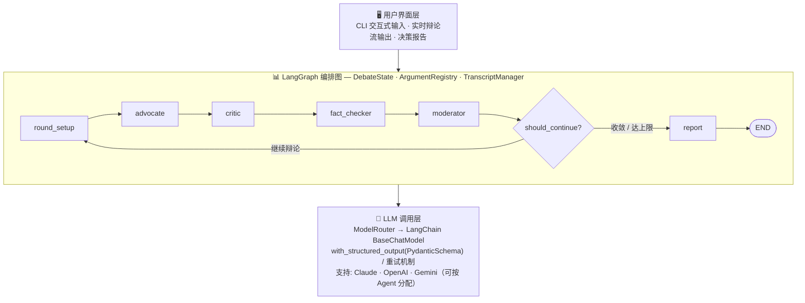
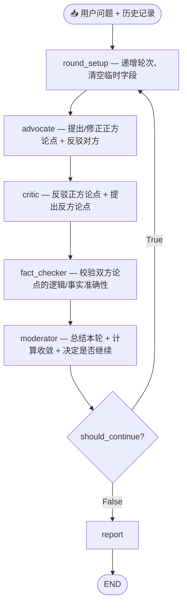
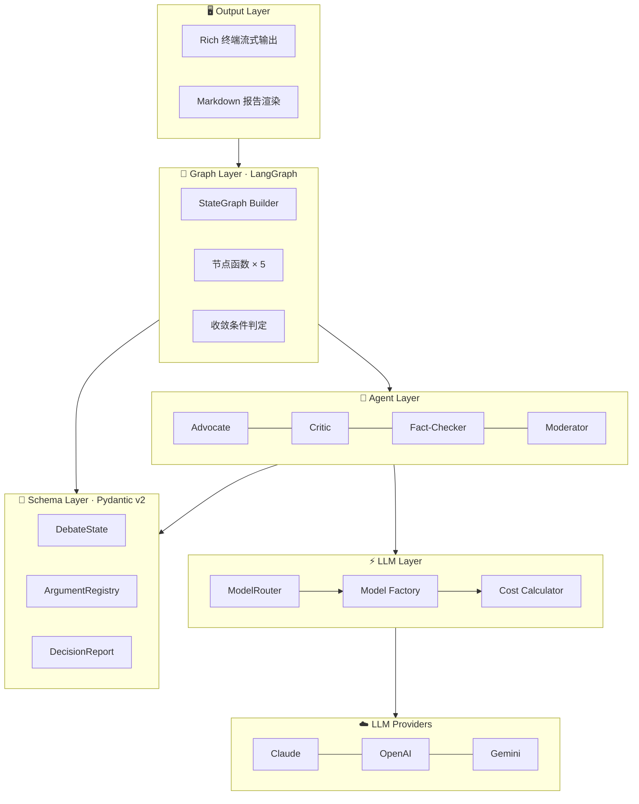

**中文** | [English](README_EN.md)

# 🏛️ MaverickJ — 多 Agent 对抗式决策引擎

> 自动化杠精，对抗赛博精神病

[](https://www.python.org/)
[](https://langchain-ai.github.io/langgraph/)
[](https://www.anthropic.com/)
[](LICENSE)

Auto-Gangjing 是一个基于多 Agent 协作的辩论式决策分析引擎。用户输入一个决策问题后，系统启动 **4 个具有不同角色定位的 AI Agent**，通过多轮结构化辩论（正方论证 → 反方反驳 → 事实校验 → 主持人裁决），模拟真实的决策审议过程，最终输出一份包含正反论点、关键分歧、风险评估和行动建议的 **结构化决策报告**。

AI 可以用大量的知识去辅助人类的决策，但是不要让 AI 取代了你的思考。杠精的存在是为了尽可能消除 RLHF（Reinforcement Learning from Human Feedback）对于人类的影响。

> 论文：[Towards Understanding Sycophancy in Language Models](https://arxiv.org/abs/2310.13548)

---

## 目录

- [核心价值](#核心价值)
- [快速开始](#快速开始)
- [使用方式](#使用方式)
- [系统架构](#系统架构)
- [Agent 角色](#agent-角色)
- [配置说明](#配置说明)
- [终端输出与报告](#终端输出与报告)
- [项目结构](#项目结构)
- [测试](#测试)
- [成本估算](#成本估算)
- [常见问题](#常见问题)
- [许可证](#许可证)

---

## 核心价值

**这不是简单的 pros/cons 列表。** 传统的 AI 问答只能给出单视角的分析，而本项目通过以下机制产出经过"压力测试"的高质量决策分析：

| 机制 | 说明 |
|------|------|
| 🔄 **动态对抗** | Critic 必须引用 Advocate 的具体论点 ID 进行反驳，而非"各说各话" |
| 📎 **证据引用** | 每个论点要求提供推理链和证据支撑，而非空泛断言 |
| 🤝 **立场修正** | Agent 必须诚实回应有效反驳，承认让步或修正论点 |
| ✅ **事实校验** | 中立的 Fact-Checker 审查双方论证的逻辑谬误和推理缺陷 |
| 📊 **收敛判定** | Moderator 实时计算收敛分数，在恰当时机终止辩论 |
| 📈 **论点生命周期** | 追踪每个论点从提出到存活/被推翻的完整历程 |

### 应用场景

> **核心原则**：任何需要在不确定信息下做出高代价、难逆转决策的场景，都可以从结构化对抗分析中获益。

- **企业战略**：并购评估、市场进入时机判断、自建 vs. 采购技术选型
- **投资尽调**：在 VC / PE 投决会之前，暴露标的公司的核心风险点
- **产品路线图**：对潜在 Epic 进行压力测试，避免团队共识偏差
- **监管 & 合规**：模拟监管方与业务方的对立立场，提前识别合规盲区
- **个人重大决策**：职业转型、城市迁移——用结构化辩论代替直觉拍脑袋
- **学术 & 教育**：模拟同行评审，帮助研究者在投稿前发现论证漏洞
- **咨询 & 智库**：为客户战略报告生成"红队"（Red Team）视角

---

## 快速开始

### 前置要求

- **Python** >= 3.12
- 至少一个 LLM API Key：[Anthropic Claude](https://console.anthropic.com/)（推荐）、[OpenAI](https://platform.openai.com/)、[Google Gemini](https://aistudio.google.com/)

### 选项 A：🐳 Docker（推荐）

```bash
git clone https://github.com/CAgcoder/auto-gangjing.git
cd auto-gangjing

cp .env.example .env
# 编辑 .env，填入至少一个 API Key
# 如果选择非 Claude 的 Provider，需同步修改 config.yaml

docker compose build
docker compose run --rm debate
```

### 选项 B：本地 Python

```bash
git clone https://github.com/CAgcoder/auto-gangjing.git
cd auto-gangjing

python -m venv .venv && source .venv/bin/activate
pip install -e .

cp .env.example .env
# 编辑 .env，填入 API Key

debate-interactive              # 交互式模式
```

### 选项 C：CLI 一次性模式

```bash
pip install -e .
python -m maverickj.main "我们应该将 Java 后端迁移到 Go 吗？" "50人团队，Spring Boot 3年"
# 输出：reports/debate-report.md
```

---

## 使用方式

### 交互式 CLI

```bash
debate-interactive
```

进入后输入决策问题和背景信息，实时观看 4 个 Agent 的彩色辩论流，辩论结束后可保存报告或开启新话题。

### 编程调用（推荐高层 API）

```python
import asyncio
from maverickj import DebateEngine

async def main():
    engine = DebateEngine(max_rounds=3)
    result = await engine.debate(
        question="我们应该迁移到微服务架构吗？",
        context="团队 30 人，当前单体应用 100 万行代码",
    )
    print(result.report.recommendation)
    print(result.to_markdown())

asyncio.run(main())
```

静默模式（无终端输出，适合集成场景）：

```python
engine = DebateEngine(on_event=None)
result = await engine.debate(question)
```

自定义事件回调：

```python
from maverickj import DebateEngine, DebateEvent

def my_handler(event: DebateEvent) -> None:
    print(f"[轮{event.round_number}] {event.type.value}")

engine = DebateEngine(on_event=my_handler)
result = await engine.debate(question)
```

### 示例脚本

```bash
python examples/java_to_go.py       # Java → Go 迁移决策
python examples/build_vs_buy.py     # 自建 vs 采购分析平台
python examples/library_api.py      # 库 API 用法示例
```

### 作为依赖库安装

```bash
pip install maverickj
# 或从 GitHub 安装最新版
pip install git+https://github.com/CAgcoder/auto-gangjing.git
```

```python
from maverickj import DebateEngine

engine = DebateEngine(provider="claude", model="claude-haiku-4-5-20251001")
result = await engine.debate("Should we adopt microservices?")
print(result.report.recommendation)
```

### MCP Server

安装 MCP 扩展并启动服务器，可集成到 Claude Desktop 等支持 MCP 协议的客户端：

```bash
pip install "maverickj[mcp]"
maverickj-mcp                  # stdio 传输（默认，适合 Claude Desktop）
maverickj-mcp --transport sse  # SSE 传输
```

Claude Desktop 配置 (`~/Library/Application Support/Claude/claude_desktop_config.json`)：

```json
{
  "mcpServers": {
    "maverickj": {
      "command": "maverickj-mcp",
      "env": {
        "ANTHROPIC_API_KEY": "sk-ant-...",
        "DEBATE_CONFIG_PATH": "/path/to/config.yaml"
      }
    }
  }
}
```

可用 MCP Tools：

| Tool | 说明 |
|------|------|
| `run_debate` | 完整辩论，返回 JSON 决策报告 |
| `run_debate_markdown` | 完整辩论，返回 Markdown 报告 |
| `create_debate_session` | 创建辩论会话（缓存结果） |
| `run_debate_round` | 逐轮获取辩论结果 |
| `get_debate_status` | 查询会话状态 |
| `finalize_debate` | 获取会话最终报告 |

---

## 系统架构



### 单轮数据流



### 分层架构



---

## Agent 角色

| Agent | 角色 | 行为 | 论点 ID 格式 |
|-------|------|------|-------------|
| 🟢 **Advocate** | 正方论证者 | 构建最强正方论证，回应反驳，对有效攻击进行让步或修正 | `ADV-R{轮}-{序号}` |
| 🔴 **Critic** | 反方批评者 | 系统性挑战正方论点，提出反驳与替代方案 | `CRT-R{轮}-{序号}` |
| 🔍 **Fact-Checker** | 事实校验者 | 中立审视双方论证质量，标记逻辑谬误（`valid` / `flawed` / `needs_context` / `unverifiable`） | — |
| ⚖️ **Moderator** | 主持人 | 控制辩论节奏，计算收敛分数（0-1），决定终止时机 | — |

### 论点生命周期

每个论点有 4 种状态：**ACTIVE**（存活）→ **MODIFIED**（修正后继续）→ **REBUTTED**（被推翻）/ **CONCEDED**（主动让步）。

`ArgumentRegistry` 全局追踪每个论点的完整生命周期，最终报告中按强度排序展示存活论点。

### 收敛终止条件

| 条件 | 说明 | 优先级 |
|------|------|--------|
| Moderator 主动终止 | `convergence_score ≥ 0.8` 且辩论趋于稳定 | 最高 |
| 连续高收敛 | 连续 2 轮 `convergence_score ≥ 0.8`，强制终止 | 高 |
| 最大轮数 | 达到 `max_rounds` 后强制终止 | 中 |
| 错误状态 | `state.status == ERROR` 立即终止 | 兜底 |

---

## 配置说明

### 环境变量（`.env`）

```bash
# 至少配置一个 Provider 的 API Key
ANTHROPIC_API_KEY=sk-ant-xxxxx
# OPENAI_API_KEY=sk-xxxxx
# GOOGLE_API_KEY=xxxxx
```

### 辩论参数（`config.yaml`）

```yaml
# 方案 A：统一模型（所有 Agent 共用）
default_provider: claude
default_model: claude-haiku-4-5-20251001
default_temperature: 0.4

# 方案 B：混合调用（取消注释以启用，可为不同 Agent 指定不同模型）
# agents:
#   advocate:
#     provider: claude
#     model: claude-sonnet-4-20250514
#     temperature: 0.7
#   critic:
#     provider: openai
#     model: gpt-4o
#     temperature: 0.7
#   fact_checker:
#     provider: openai
#     model: gpt-4o-mini        # 成本优化
#     temperature: 0.3
#   moderator:
#     provider: claude
#     model: claude-haiku-4-5-20251001  # 速度优化
#     temperature: 0.5

debate:
  max_rounds: 5                # 最大辩论轮数
  convergence_threshold: 2     # 连续收敛轮数阈值
  convergence_score_target: 0.8  # 收敛分数目标
  language: auto               # auto / zh / en
  transcript_compression_after_round: 2  # 超过 N 轮后压缩历史
```

### Docker 配置

- `.env` 文件通过 `docker-compose.yml` 的 `env_file: .env` 自动加载
- `config.yaml` 通过 Volume mount 映射，支持运行时修改

---

## 终端输出与报告

### CLI 实时辩论流

使用 [Rich](https://github.com/Textualize/rich) 库提供彩色终端体验：

```
╔══════════════════════════════════════════════════════════╗
║          🏛️  多 Agent 辩论式决策引擎                      ║
╚══════════════════════════════════════════════════════════╝

📌 决策问题: 我们应该将 Java 服务迁移到 Go 吗？

════════════════════════════════════════════════════════════
  📢 第 1 轮辩论
════════════════════════════════════════════════════════════

🟢 正方论证者（Advocate）发言中...
  [ADV-R1-01] Go 的内存占用仅为 Java 的 1/10，显著降低部署成本
  [ADV-R1-02] Go 的冷启动时间远优于 Java，适合 Serverless 架构

🔴 反方批评者（Critic）发言中...
  [CRT-R1-01] 迁移成本被严重低估，50人团队恢复生产力需12-18个月
  ↩ ADV-R1-01: Java 21 虚拟线程和 GraalVM 已大幅改善资源消耗

🔍 事实校验者（Fact-Checker）校验中...
  ✅ ADV-R1-01: valid - 逻辑自洽
  ⚠️ CRT-R1-01: needs_context - 缺少具体迁移案例数据

⚖️ 主持人（Moderator）裁决中...
  📊 收敛分数: [████████░░░░░░░░░░░░] 40%
  ➡️ 继续辩论
```

### Markdown 报告

辩论结束后自动保存至 `reports/debate-report.md`，采用**两段式结构**：

**第一部分：完整辩论记录** — 逐轮展示所有 Agent 的完整发言（论点、反驳、让步、校验结果、收敛进度）

**第二部分：总结分析** — 执行摘要、建议方向（含置信度）、正反方存活论点（按强度排序）、已解决/未解决分歧、风险因素、后续行动、辩论统计

---

## 项目结构

```
auto-gangjing/
├── config.yaml                 # 默认配置（模型、轮数等）
├── pyproject.toml              # 项目依赖与打包
├── Dockerfile                  # Docker 镜像定义
├── docker-compose.yml          # 容器编排
├── maverickj/
│   ├── __init__.py             # 公共 API（from maverickj import DebateEngine）
│   ├── engine.py               # DebateEngine / DebateResult Facade
│   ├── events.py               # 事件系统（DebateEvent, EventCallback）
│   ├── main.py                 # CLI 一次性入口（debate 命令）
│   ├── cli.py                  # 交互式入口（debate-interactive 命令）
│   ├── mcp_server.py           # MCP Server（maverickj-mcp 命令）
│   ├── schemas/                # Pydantic v2 数据模型
│   │   ├── agents.py           #   Agent 响应格式
│   │   ├── arguments.py        #   论点 / 反驳 / 事实检查
│   │   ├── config.py           #   配置 Schema
│   │   ├── debate.py           #   辩论状态与元数据
│   │   └── report.py           #   决策报告格式
│   ├── agents/                 # Agent 实现（BaseAgent → 4 个具体 Agent）
│   ├── graph/                  # LangGraph 编排（StateGraph Builder + 收敛条件 + 节点函数）
│   ├── llm/                    # LLM 路由层（ModelRouter + Factory + Cost）
│   ├── prompts/                # 各 Agent 的 Prompt 构造
│   ├── core/                   # 核心逻辑（ArgumentRegistry + TranscriptManager）
│   ├── output/                 # 输出渲染（Rich 终端流 + Markdown 报告）
│   └── templates/              # Jinja2 报告模板
├── examples/                   # 使用示例
├── skills/                     # 对抗式辩论 Skill 文档（可移植到其他框架）
│   └── adversarial-debate/
└── tests/                      # 测试用例
```

---

## 测试

```bash
pip install -e ".[dev]"
pytest                   # 运行全部测试
pytest -v --tb=short     # 详细输出
ruff check maverickj/ tests/   # Lint
ruff format maverickj/ tests/  # Format
```

| 测试模块 | 用例数 | 覆盖范围 |
|---------|-------|---------|
| `test_core/test_argument_registry.py` | 7 | 论点注册、状态更新、反驳追踪、存活统计 |
| `test_core/test_transcript_manager.py` | 3 | 上下文构建、历史压缩 |
| `test_graph/test_conditions.py` | 6 | 四种收敛条件判断 |
| `test_output/test_renderer.py` | 2 | Markdown 渲染正确性 |

---

## 成本估算

| 场景 | 轮数 | LLM 调用 | 预估成本 |
|------|------|----------|---------|
| 简单决策（立场明确） | 2–3 | ~9–13 | ~$0.10–$0.20 |
| 复杂决策（多因素） | 4–5 | ~17–21 | ~$0.30–$0.50 |
| 成本优化（Gemini Flash） | 3–4 | ~13–17 | ~$0.02–$0.05 |

*基于 Claude Sonnet 定价；Gemini Flash 约便宜 10 倍*

---

## 常见问题

**Q: 如何修改辩论轮数或收敛阈值？**
编辑 `config.yaml` 的 `debate` 部分，调整 `max_rounds`、`convergence_threshold`、`convergence_score_target`。

**Q: Docker 启动后输入问题没反应？**
确保 Docker Desktop 正在运行、`.env` 包含有效 API Key、`docker compose build` 成功完成。

**Q: 支持本地离线运行吗？**
不支持。系统需要调用 LLM API（Claude / OpenAI / Gemini）。

**Q: 如何节省 LLM 成本？**
多种策略：为不同 Agent 配置不同模型（混合模式）、降低 Fact-Checker 模型版本、减少 `max_rounds`、使用 Gemini Flash 等低成本 Provider。

**Q: 支持其他 LLM Provider 吗？**
当前支持 Claude、OpenAI、Google Gemini。任何 LangChain 兼容的 `BaseChatModel` 均可扩展，在 `maverickj/llm/factory.py` 中添加即可。

---

## 许可证

[MIT](LICENSE) — 欢迎提交 Issue 和 Pull Request！
