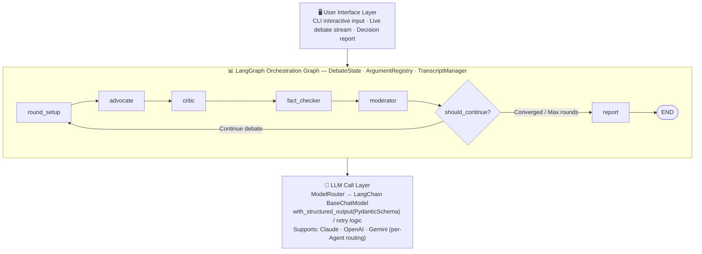
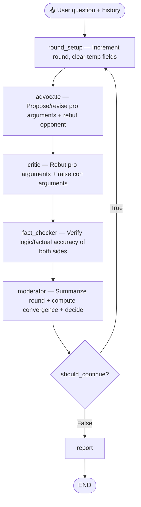
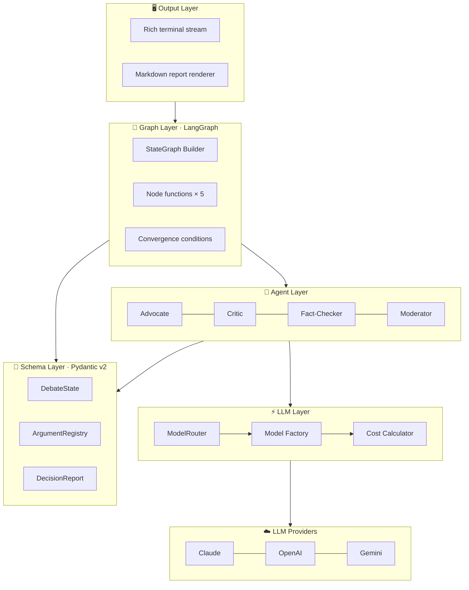

[中文](README.md) | **English**

# 🏛️ MaverickJ — Multi-Agent Debate-Driven Decision Engine

> Automated devil's advocate — combating cyber sycophancy

[](https://www.python.org/)
[](https://langchain-ai.github.io/langgraph/)
[](https://www.anthropic.com/)
[](LICENSE)

Auto-Gangjing is a debate-driven decision analysis engine built on multi-agent collaboration. When a user submits a decision question, the system launches **4 AI Agents with distinct roles** to conduct multi-round structured debate (Pro arguments → Con rebuttals → Fact verification → Moderator ruling), simulating a real deliberative process, and ultimately outputs a **structured decision report** containing pro/con arguments, key divergences, risk assessments, and action recommendations.

AI can augment human decision-making with vast knowledge — but don't let AI replace your thinking. The devil's advocate exists to counteract the influence of RLHF (Reinforcement Learning from Human Feedback) on human judgment.

> Paper: [Towards Understanding Sycophancy in Language Models](https://arxiv.org/abs/2310.13548)

---

## Table of Contents

- [Core Value](#core-value)
- [Quick Start](#quick-start)
- [Usage](#usage)
- [System Architecture](#system-architecture)
- [Agent Roles](#agent-roles)
- [Configuration](#configuration)
- [Terminal Output & Reports](#terminal-output--reports)
- [Project Structure](#project-structure)
- [Testing](#testing)
- [Cost Estimation](#cost-estimation)
- [FAQ](#faq)
- [License](#license)

---

## Core Value

**This is not a simple pros/cons list.** Traditional AI Q&A provides only single-perspective analysis. This project produces high-quality, stress-tested decision analysis through the following mechanisms:

| Mechanism | Description |
|-----------|-------------|
| 🔄 **Dynamic Adversarial Debate** | Critic must cite the Advocate's specific argument IDs when rebutting — no talking past each other |
| 📎 **Evidence Citation** | Each argument requires a reasoning chain and supporting evidence, not vague assertions |
| 🤝 **Position Revision** | Agents must honestly respond to valid rebuttals, concede points, or revise their arguments |
| ✅ **Fact Verification** | A neutral Fact-Checker examines both sides for logical fallacies and reasoning flaws |
| 📊 **Convergence Judgment** | Moderator calculates a convergence score in real time and terminates debate at the right moment |
| 📈 **Argument Lifecycle** | Tracks every argument from proposal through survival/refutation |

### Use Cases

> **Core Principle**: Any decision that is high-cost, hard to reverse, and made under uncertainty can benefit from structured adversarial analysis.

- **Corporate Strategy**: M&A evaluation, market entry timing, build-vs-buy technology decisions
- **Investment Due Diligence**: Surface core risk factors before a VC/PE investment committee meeting
- **Product Roadmap**: Stress-test proposed Epics, preventing groupthink from obscuring threats
- **Regulatory & Compliance**: Simulate opposing stances between regulators and business units
- **High-Stakes Personal Decisions**: Career pivots, relocation — structured debate instead of gut instinct
- **Academic & Education**: Simulate peer-review scrutiny to find reasoning gaps before submission
- **Consulting & Think Tanks**: Generate a "Red Team" perspective for client strategy reports

---

## Quick Start

### Prerequisites

- **Python** >= 3.12
- At least one LLM API Key: [Anthropic Claude](https://console.anthropic.com/) (recommended), [OpenAI](https://platform.openai.com/), [Google Gemini](https://aistudio.google.com/)

### Option A: 🐳 Docker (Recommended)

```bash
git clone https://github.com/CAgcoder/auto-gangjing.git
cd auto-gangjing

cp .env.example .env
# Edit .env, fill in at least one API Key
# If using a non-Claude provider, update config.yaml accordingly

docker compose build
docker compose run --rm debate
```

### Option B: Local Python

```bash
git clone https://github.com/CAgcoder/auto-gangjing.git
cd auto-gangjing

python -m venv .venv && source .venv/bin/activate
pip install -e .

cp .env.example .env
# Edit .env, fill in API Key

debate-interactive              # Interactive mode
```

### Option C: CLI One-Shot

```bash
pip install -e .
python -m maverickj.main "Should we migrate our Java backend to Go?" "50-person team, Spring Boot for 3 years"
# Output: reports/debate-report.md
```

---

## Usage

### Interactive CLI

```bash
debate-interactive
```

Enter your decision question and background context, watch the 4 Agents debate in real time with color-coded output, then save the report or start a new topic.

### Programmatic API (Recommended)

```python
import asyncio
from maverickj import DebateEngine

async def main():
    engine = DebateEngine(max_rounds=3)
    result = await engine.debate(
        question="Should we migrate to a microservices architecture?",
        context="30-person team, current monolith is 1M lines of code",
    )
    print(result.report.recommendation)
    print(result.to_markdown())

asyncio.run(main())
```

Silent mode (no terminal output, ideal for integration):

```python
engine = DebateEngine(on_event=None)
result = await engine.debate(question)
```

Custom event callbacks:

```python
from maverickj import DebateEngine, DebateEvent

def my_handler(event: DebateEvent) -> None:
    print(f"[Round {event.round_number}] {event.type.value}")

engine = DebateEngine(on_event=my_handler)
result = await engine.debate(question)
```

### Example Scripts

```bash
python examples/java_to_go.py       # Java → Go migration decision
python examples/build_vs_buy.py     # Build vs. buy analytics platform
python examples/library_api.py      # Library API usage example
```

### Install as a Dependency

```bash
pip install maverickj
# Or install the latest from GitHub
pip install git+https://github.com/CAgcoder/auto-gangjing.git
```

```python
from maverickj import DebateEngine

engine = DebateEngine(provider="claude", model="claude-haiku-4-5-20251001")
result = await engine.debate("Should we adopt microservices?")
print(result.report.recommendation)
```

### MCP Server

Install the MCP extension and start the server for integration with Claude Desktop or other MCP-compatible clients:

```bash
pip install "maverickj[mcp]"
maverickj-mcp                  # stdio transport (default, for Claude Desktop)
maverickj-mcp --transport sse  # SSE transport
```

Claude Desktop config (`~/Library/Application Support/Claude/claude_desktop_config.json`):

```json
{
  "mcpServers": {
    "maverickj": {
      "command": "maverickj-mcp",
      "env": {
        "ANTHROPIC_API_KEY": "sk-ant-...",
        "DEBATE_CONFIG_PATH": "/path/to/config.yaml"
      }
    }
  }
}
```

Available MCP Tools:

| Tool | Description |
|------|-------------|
| `run_debate` | Full debate, returns JSON decision report |
| `run_debate_markdown` | Full debate, returns Markdown report |
| `create_debate_session` | Create a debate session (cached results) |
| `run_debate_round` | Get debate results round by round |
| `get_debate_status` | Query session status |
| `finalize_debate` | Get final session report |

---

## System Architecture



### Single-Round Data Flow



### Layered Architecture



---

## Agent Roles

| Agent | Role | Behavior | Argument ID Format |
|-------|------|----------|-------------------|
| 🟢 **Advocate** | Pro-side advocate | Builds the strongest pro case, responds to rebuttals, concedes or revises when effectively challenged | `ADV-R{round}-{seq}` |
| 🔴 **Critic** | Con-side critic | Systematically challenges pro arguments, raises counterpoints and alternatives | `CRT-R{round}-{seq}` |
| 🔍 **Fact-Checker** | Neutral verifier | Audits argument quality from both sides, flags fallacies (`valid` / `flawed` / `needs_context` / `unverifiable`) | — |
| ⚖️ **Moderator** | Debate moderator | Controls debate pace, computes convergence score (0–1), decides termination | — |

### Argument Lifecycle

Each argument has 4 possible states: **ACTIVE** (alive) → **MODIFIED** (revised and still alive) → **REBUTTED** (refuted) / **CONCEDED** (voluntarily conceded).

`ArgumentRegistry` globally tracks the full lifecycle of every argument. Surviving arguments are sorted by strength in the final report.

### Convergence Termination Conditions

| Condition | Description | Priority |
|-----------|-------------|----------|
| Moderator-initiated | `convergence_score ≥ 0.8` and debate is stabilizing | Highest |
| Consecutive high convergence | 2 consecutive rounds with `convergence_score ≥ 0.8`, forced termination | High |
| Max rounds | Forced termination after reaching `max_rounds` | Medium |
| Error state | `state.status == ERROR`, immediate termination | Fallback |

---

## Configuration

### Environment Variables (`.env`)

```bash
# Configure at least one provider's API Key
ANTHROPIC_API_KEY=sk-ant-xxxxx
# OPENAI_API_KEY=sk-xxxxx
# GOOGLE_API_KEY=xxxxx
```

### Debate Parameters (`config.yaml`)

```yaml
# Option A: Unified model (shared by all Agents)
default_provider: claude
default_model: claude-haiku-4-5-20251001
default_temperature: 0.4

# Option B: Mixed providers (uncomment to enable per-Agent model assignment)
# agents:
#   advocate:
#     provider: claude
#     model: claude-sonnet-4-20250514
#     temperature: 0.7
#   critic:
#     provider: openai
#     model: gpt-4o
#     temperature: 0.7
#   fact_checker:
#     provider: openai
#     model: gpt-4o-mini        # Cost optimization
#     temperature: 0.3
#   moderator:
#     provider: claude
#     model: claude-haiku-4-5-20251001  # Speed optimization
#     temperature: 0.5

debate:
  max_rounds: 5                # Maximum debate rounds
  convergence_threshold: 2     # Consecutive convergence rounds threshold
  convergence_score_target: 0.8  # Convergence score target
  language: auto               # auto / zh / en
  transcript_compression_after_round: 2  # Compress history after N rounds
```

### Docker Configuration

- `.env` is auto-loaded via `env_file: .env` in `docker-compose.yml`
- `config.yaml` is volume-mounted, allowing runtime modifications

---

## Terminal Output & Reports

### CLI Live Debate Stream

Powered by [Rich](https://github.com/Textualize/rich) for color-coded terminal output:

```
╔══════════════════════════════════════════════════════════╗
║       🏛️  Multi-Agent Debate Decision Engine             ║
╚══════════════════════════════════════════════════════════╝

📌 Question: Should we migrate our Java services to Go?

════════════════════════════════════════════════════════════
  📢 Round 1
════════════════════════════════════════════════════════════

🟢 Advocate speaking...
  [ADV-R1-01] Go's memory footprint is 1/10 of Java, significantly reducing deployment costs
  [ADV-R1-02] Go's cold start time far exceeds Java, ideal for Serverless

🔴 Critic speaking...
  [CRT-R1-01] Migration costs are severely underestimated, 50-person team needs 12-18 months
  ↩ ADV-R1-01: Java 21 virtual threads and GraalVM have greatly improved resource consumption

🔍 Fact-Checker verifying...
  ✅ ADV-R1-01: valid - logically consistent
  ⚠️ CRT-R1-01: needs_context - missing concrete migration case data

⚖️ Moderator ruling...
  📊 Convergence: [████████░░░░░░░░░░░░] 40%
  ➡️ Continue debate
```

### Markdown Report

Automatically saved to `reports/debate-report.md` after debate completion, using a **two-part structure**:

**Part 1: Full Debate Transcript** — complete per-round output from every Agent (arguments, rebuttals, concessions, fact-check results, convergence progress)

**Part 2: Summary Analysis** — executive summary, recommendation (with confidence level), surviving pro/con arguments (sorted by strength), resolved/unresolved disagreements, risk factors, next steps, debate statistics

---

## Project Structure

```
auto-gangjing/
├── config.yaml                 # Default config (models, rounds, etc.)
├── pyproject.toml              # Dependencies & packaging
├── Dockerfile                  # Docker image definition
├── docker-compose.yml          # Container orchestration
├── maverickj/
│   ├── __init__.py             # Public API (from maverickj import DebateEngine)
│   ├── engine.py               # DebateEngine / DebateResult facade
│   ├── events.py               # Event system (DebateEvent, EventCallback)
│   ├── main.py                 # CLI one-shot entry (debate command)
│   ├── cli.py                  # Interactive entry (debate-interactive command)
│   ├── mcp_server.py           # MCP Server (maverickj-mcp command)
│   ├── schemas/                # Pydantic v2 data models
│   │   ├── agents.py           #   Agent response formats
│   │   ├── arguments.py        #   Arguments / rebuttals / fact checks
│   │   ├── config.py           #   Config schema
│   │   ├── debate.py           #   Debate state & metadata
│   │   └── report.py           #   Decision report format
│   ├── agents/                 # Agent implementations (BaseAgent → 4 concrete Agents)
│   ├── graph/                  # LangGraph orchestration (StateGraph Builder + conditions + nodes)
│   ├── llm/                    # LLM routing (ModelRouter + Factory + Cost)
│   ├── prompts/                # Per-Agent prompt construction
│   ├── core/                   # Core logic (ArgumentRegistry + TranscriptManager)
│   ├── output/                 # Output rendering (Rich terminal stream + Markdown report)
│   └── templates/              # Jinja2 report templates
├── examples/                   # Usage examples
├── skills/                     # Adversarial debate Skill docs (portable to other frameworks)
│   └── adversarial-debate/
└── tests/                      # Test suite
```

---

## Testing

```bash
pip install -e ".[dev]"
pytest                   # Run all tests
pytest -v --tb=short     # Verbose output
ruff check maverickj/ tests/   # Lint
ruff format maverickj/ tests/  # Format
```

| Test Module | Cases | Coverage |
|-------------|-------|----------|
| `test_core/test_argument_registry.py` | 7 | Argument registration, status updates, rebuttal tracking, survival stats |
| `test_core/test_transcript_manager.py` | 3 | Context building, history compression |
| `test_graph/test_conditions.py` | 6 | Four convergence condition checks |
| `test_output/test_renderer.py` | 2 | Markdown rendering correctness |

---

## Cost Estimation

| Scenario | Rounds | LLM Calls | Approx. Cost |
|----------|--------|-----------|--------------|
| Simple decision (clear position) | 2–3 | ~9–13 | ~$0.10–$0.20 |
| Complex decision (multi-factor) | 4–5 | ~17–21 | ~$0.30–$0.50 |
| Cost-optimized (Gemini Flash) | 3–4 | ~13–17 | ~$0.02–$0.05 |

*Based on Claude Sonnet pricing; Gemini Flash is approximately 10× cheaper*

---

## FAQ

**Q: How do I change the number of debate rounds or convergence threshold?**
Edit the `debate` section in `config.yaml` — adjust `max_rounds`, `convergence_threshold`, `convergence_score_target`.

**Q: Docker starts but nothing happens after entering a question?**
Ensure Docker Desktop is running, `.env` contains a valid API Key, and `docker compose build` completed successfully.

**Q: Does it work offline?**
No. The system requires LLM API calls (Claude / OpenAI / Gemini).

**Q: How can I reduce LLM costs?**
Multiple strategies: assign different models per Agent (mixed mode), use a lighter model for Fact-Checker, reduce `max_rounds`, or use low-cost providers like Gemini Flash.

**Q: Can it use providers other than Claude/OpenAI/Gemini?**
Currently supports Claude, OpenAI, and Google Gemini. Any LangChain-compatible `BaseChatModel` can be added in `maverickj/llm/factory.py`.

---

## License

[MIT](LICENSE) — Contributions welcome!
