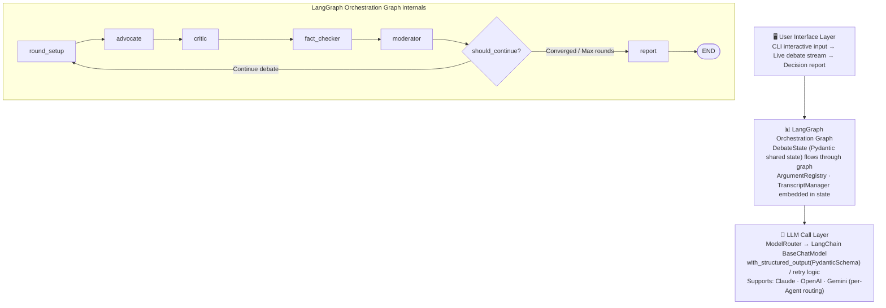
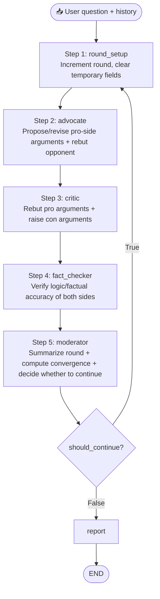
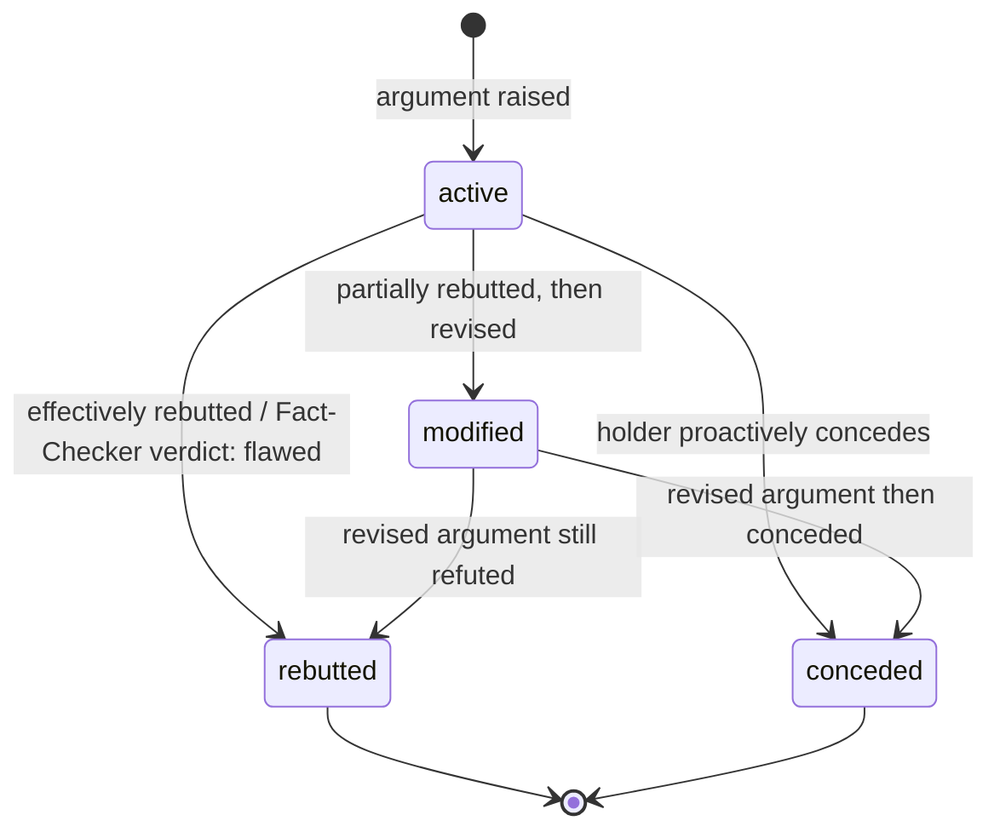

[中文](README.md) | **English**

# 🏛️ Auto-Gangjing — Multi-Agent Debate-Driven Decision Engine

> Automated devil's advocate — combating cyber sycophancy

[](https://www.python.org/)
[](https://langchain-ai.github.io/langgraph/)
[](https://www.anthropic.com/)
[](LICENSE)

---

## Table of Contents

- [Project Overview](#project-overview)
- [Core Value](#core-value)
- [System Architecture](#system-architecture)
- [Key Features & Implementation Details](#key-features--implementation-details)
  - [1. Four-Agent Collaborative Debate System](#1-four-agent-collaborative-debate-system)
  - [2. LangGraph Orchestration Graph](#2-langgraph-orchestration-graph)
  - [3. Argument Registry & Lifecycle Tracking](#3-argument-registry--lifecycle-tracking)
  - [4. LLM Call Layer & Structured Output](#4-llm-call-layer--structured-output)
  - [5. Multi-Round Convergence Mechanism](#5-multi-round-convergence-mechanism)
  - [6. Decision Report Generation](#6-decision-report-generation)
  - [7. CLI Live Debate Stream](#7-cli-live-debate-stream)
- [Project Structure](#project-structure)
- [Quick Start](#quick-start)
- [Configuration](#configuration)
- [Usage](#usage)
- [Output Examples](#output-examples)
- [Dependencies](#dependencies)
- [Testing](#testing)
- [Cost Estimation](#cost-estimation)

---

## Project Overview

Auto-Gangjing is a debate-driven decision analysis engine built on multi-agent collaboration. When a user submits a business decision question, the system launches **4 AI Agents with distinct roles** to conduct multi-round structured debate (Pro arguments → Con rebuttals → Fact verification → Moderator ruling), simulating a real deliberative process, and ultimately outputs a **structured decision report** containing pro/con arguments, key divergences, risk assessments, and action recommendations.

AI can augment human decision-making with vast knowledge — but don't let AI replace your thinking. The devil's advocate exists to counteract the influence of RLHF (Reinforcement Learning from Human Feedback) on human judgment.

Paper: *Towards Understanding Sycophancy in Language Models* (https://arxiv.org/abs/2310.13548)

The entire system is built on **Python 3.12+**, uses **LangGraph** to construct a stateful multi-agent orchestration graph, leverages **LangChain Core** as a unified abstraction layer supporting Claude / OpenAI / Gemini, and validates all Agent output against **Pydantic v2** schemas.

---

## Core Value

**This is not a simple pros/cons list.** Traditional AI Q&A provides only single-perspective analysis. This project produces high-quality, stress-tested decision analysis through the following mechanisms:

| Mechanism | Description |
|-----------|-------------|
| 🔄 **Dynamic Adversarial Debate** | Critic must cite the Advocate's specific argument IDs when rebutting — no talking past each other |
| 📎 **Evidence Citation** | Each argument requires a reasoning chain and supporting evidence, not vague assertions |
| 🤝 **Position Revision** | Agents must honestly respond to valid rebuttals, concede points, or revise their arguments |
| ✅ **Fact Verification** | A neutral Fact-Checker examines both sides for logical fallacies and reasoning flaws |
| 📊 **Convergence Judgment** | Moderator calculates a convergence score in real time and terminates debate at the right moment |
| 📈 **Argument Lifecycle** | Tracks every argument from proposal through survival/refutation |

### Real-World Use Cases

This adversarial analysis framework extends well beyond software decisions. Here are some representative application areas:

- **Corporate Strategy**: M&A evaluation, market entry timing, build-vs-buy technology decisions (see `examples/build_vs_buy.py`) — let stakeholders face the strongest counter-arguments before committing.
- **Investment Due Diligence**: Surface a target company's core risk factors before a VC/PE investment committee meeting, replacing the one-sided optimism of traditional pitch deck analysis.
- **Product Roadmap Planning**: Product owners can stress-test each proposed Epic during quarterly planning, preventing groupthink from obscuring user pain points or competitive threats.
- **Regulatory & Compliance Review**: Simulate opposing stances between regulators and business units before a new policy goes live, identifying compliance blind spots and implementation friction early.
- **High-Stakes Personal Decisions**: Career pivots, relocation, major purchases — when information is incomplete, structured debate replaces gut instinct and forces you to confront worst-case scenarios.
- **Academic & Education**: Simulate peer-review scrutiny to help researchers find reasoning gaps before submission; also useful for debate training to generate high-quality opposing arguments.
- **Consulting & Think Tanks**: Generate a "Red Team" perspective for client strategy reports, replacing consultant subjectivity with a traceable chain of cited arguments.

> **Core Principle**: Any decision that is high-cost, hard to reverse, and made under uncertainty can benefit from structured adversarial analysis.

---

## System Architecture



**Data flow (single round):**



---

## Key Features & Implementation Details

### 1. Four-Agent Collaborative Debate System

The system includes 4 AI Agents with clearly defined roles. All inherit from the same `BaseAgent` abstract base class and use Pydantic v2 schemas to guarantee type safety across inputs and outputs.

#### Advocate Agent (Pro-Side Advocate)

- **Role:** Senior business strategy consultant, building the strongest pro-side case ("should do")
- **Behavioral rules:**
  - Round 1: independently present 3–5 core pro-side arguments, each with `claim`, `reasoning`, `evidence`
  - Subsequent rounds: respond to Critic's rebuttals and Fact-Checker's verdicts
  - Concede (`concessions`) or revise (`status: modified`) effectively rebutted arguments
  - Rebut Critic's arguments, must cite `target_argument_id`
  - Forbidden: ignoring valid rebuttals, repeating refuted arguments
- **Argument ID format:** `ADV-R{round}-{seq}`, e.g. `ADV-R1-01`
- **Implementation:** `src/agents/advocate.py` + `src/prompts/advocate.py`

#### Critic Agent (Con-Side Critic)

- **Role:** Rigorous risk analyst, systematically challenging pro-side arguments
- **Behavioral rules:**
  - Examine each Advocate argument for logical gaps, hidden assumptions, missing considerations
  - Produce a `Rebuttal` for each challenged argument, must cite specific argument ID
  - Simultaneously raise independent con-side arguments
  - Concede only when a pro argument is genuinely unassailable
  - Forbidden: sophistry and straw-man fallacies — must attack the opponent's actual argument
- **Argument ID format:** `CRT-R{round}-{seq}`, e.g. `CRT-R1-01`
- **Implementation:** `src/agents/critic.py` + `src/prompts/critic.py`

#### Fact-Checker Agent (Neutral Fact-Checker)

- **Role:** Professor of logic, neutral third party
- **Behavioral rules:**
  - Evaluate all `active` arguments and rebuttals from the current round
  - Four possible verdicts:
    - `valid` — logically consistent; reasoning sound
    - `flawed` — logical fallacy or reasoning error (automatically triggers `rebutted` status)
    - `needs_context` — argument is sound but lacks critical context
    - `unverifiable` — cannot be judged with currently available information
  - Explicitly call out cognitive biases (confirmation bias, survivorship bias, etc.)
  - Does not take sides; evaluates only argument quality
- **Implementation:** `src/agents/fact_checker.py` + `src/prompts/fact_checker.py`

#### Moderator Agent (Host / Convergence Controller)

- **Role:** Debate moderator, controlling pace, judging convergence, guiding focus
- **Behavioral rules:**
  - Summarize each round's progress (`round_summary`)
  - Identify current key unresolved divergences (`key_divergences`)
  - Calculate convergence score (`convergence_score`, 0–1)
  - Decide whether to continue (`should_continue`)
  - Provide next-round focus guidance (`guidance_for_next_round`)
- **Implementation:** `src/agents/moderator.py` + `src/prompts/moderator.py`

#### Base Agent Design

All Agents inherit from `BaseAgent` (`src/agents/base.py`), providing a unified interface:

```python
class BaseAgent(ABC):
    MAX_RETRIES = 2

    async def invoke(
        self,
        system_prompt: str,
        user_message: str,
        output_schema: type[BaseModel],
    ) -> BaseModel: ...
```

The `invoke()` method has built-in **Pydantic validation failure auto-retry**: when LLM output cannot be parsed as a valid schema, it automatically appends a corrective message asking the LLM to reformat, up to 2 retries.

---

### 2. LangGraph Orchestration Graph

The core orchestration logic lives in `build_debate_graph()` in `src/graph/builder.py`, building a directed cyclic graph based on **LangGraph `StateGraph`**.

**Graph structure:**

```python
graph.add_node("round_setup", round_setup_node)
graph.add_node("advocate",    partial(advocate_node,    router=router))
graph.add_node("critic",      partial(critic_node,      router=router))
graph.add_node("fact_checker",partial(fact_checker_node,router=router))
graph.add_node("moderator",   partial(moderator_node,   router=router))
graph.add_node("report",      partial(report_node,      router=router))

graph.add_edge("round_setup",  "advocate")
graph.add_edge("advocate",     "critic")
graph.add_edge("critic",       "fact_checker")
graph.add_edge("fact_checker", "moderator")
graph.add_conditional_edges(
    "moderator",
    should_continue,
    {"continue": "round_setup", "end": "report"},
)
graph.add_edge("report", END)
```

**Convergence conditions (`src/graph/conditions.py`):**

| Termination Condition | Logic | Priority |
|----------------------|-------|----------|
| **Moderator-initiated** | `should_continue=False` + `convergence_score ≥ 0.8` | Highest |
| **Consecutive high convergence** | Even if Moderator wants to continue, if 2 consecutive rounds have `convergence_score ≥ 0.8`, the conditional edge forces termination | High |
| **Max rounds reached** | `current_round >= config.max_rounds` | Medium |
| **Error state** | `state.status == DebateStatus.ERROR` | Fallback |

Every termination records `state.convergence_reason`, visible in the report.

---

### 3. Argument Registry & Lifecycle Tracking

`ArgumentRegistry` (`src/core/argument_registry.py`) is the global argument tracker, maintaining each argument's complete lifecycle from proposal to final status. Embedded as a dictionary in `DebateState` and passed through LangGraph state — no external storage needed.

**Core data structure (Pydantic):**

```python
class ArgumentRecord(BaseModel):
    argument: Argument
    raised_in_round: int
    raised_by: Literal["advocate", "critic"]
    rebuttals: list[Rebuttal] = []
    fact_checks: list[FactCheck] = []
```

**Argument status transitions:**



**Key methods:**

| Method | Function |
|--------|----------|
| `register(arg, round, agent)` | Register a new argument |
| `add_rebuttal(target_id, rebuttal)` | Record a rebuttal against an argument |
| `add_fact_check(target_id, check)` | Record fact check result; flawed → auto-mark as rebutted |
| `get_active_arguments(side=None)` | Get all surviving arguments (active + modified) |
| `get_survivor_stats()` | Get argument survival statistics |

---

### 4. LLM Call Layer & Structured Output

#### ModelRouter (`src/llm/router.py`)

- Based on **LangChain Core `BaseChatModel`** unified abstraction; supports routing different LLMs per Agent role
- `get_structured_model(role, schema)` calls **`model.with_structured_output(PydanticSchema)`**, with parsing and retry handled by LangChain
- Supports `model.with_fallbacks([backup_model])` for fallback configuration

```python
# Route different models by role
router.get_model("advocate")      # → ChatAnthropic / ChatOpenAI / ChatGoogleGenerativeAI
router.get_structured_model("fact_checker", FactCheckResponse)
```

#### Multi-Provider Support (`src/llm/factory.py`)

| `provider` field | Instantiated class |
|-----------------|-------------------|
| `claude` | `ChatAnthropic` |
| `openai` | `ChatOpenAI` |
| `gemini` | `ChatGoogleGenerativeAI` |

#### Structured Output Schemas (`src/schemas/`)

All Agent output is strictly validated by Pydantic v2 schemas:

| Schema | Validates |
|--------|-----------|
| `AgentResponse` | Advocate / Critic output (arguments, rebuttals, concessions, confidence shift) |
| `FactCheckResponse` | Fact-Checker verification results |
| `ModeratorResponse` | Moderator ruling (convergence score, whether to continue, etc.) |
| `DecisionReport` | Final decision report |

All numeric fields include range constraints (e.g. `confidence_shift: float` bounded in [-1, 1], `convergence_score: float` bounded in [0, 1], `strength: int` bounded in [1, 10]).

---

### 5. Multi-Round Convergence Mechanism

Debates don't run indefinitely. The system implements **four-layer convergence guarantees**:

| Termination Condition | Logic | Priority |
|----------------------|-------|----------|
| **Moderator-initiated** | Moderator is guided in the prompt to compute a convergence score and set `should_continue=False` when the score ≥ 0.8 and debate is stabilizing | Highest |
| **Consecutive high convergence** | Even if Moderator wants to continue, if 2 consecutive rounds have `convergence_score ≥ 0.8`, the conditional edge forces termination | High |
| **Hard round cap** | Forced termination after reaching `max_rounds` | Medium |
| **Error state** | `state.status == ERROR` triggers immediate termination | Fallback |

**Convergence score factors (evaluated by Moderator Agent):**
- Is the number of new arguments from both sides decreasing?
- Are concessions increasing?
- Are key divergences narrowing?
- Are both sides' confidence shifts trending toward 0?

Every termination records a reason in `state.convergence_reason`, visible in the final report.

---

### 6. Decision Report Generation

After debate termination, `report_node` (`src/graph/nodes/report.py`) makes one independent LLM call to generate a structured `DecisionReport`, which is then rendered to Markdown by `render_report_to_markdown()` (`src/output/renderer.py`) and automatically saved to `reports/debate-report.md`.

The report uses a **two-part structure**:

**Part 1: Full Debate Transcript**

Displays each round's complete agent output in order:
- 🟢 Advocate: arguments (with reasoning & evidence), rebuttals, concessions, confidence shift
- 🔴 Critic: same
- 🔍 Fact-Checker: per-argument verdicts (✅/❌/⚠️/❓) and overall assessment
- ⚖️ Moderator: round summary, key divergences, convergence progress bar, next-round focus
- Debate termination status and reason

**Part 2: Summary Analysis**

| Section | Description |
|---------|-------------|
| **Executive Summary** | 3–5 sentence summary of debate conclusions |
| **Recommendation** | Direction, confidence level (high/medium/low), preconditions |
| **Surviving Pro Arguments** | Sorted by strength; includes rebuttal survival count and revision history |
| **Surviving Con Arguments** | Same as above |
| **Resolved Disagreements** | Points where both sides reached consensus during debate |
| **Unresolved Disagreements** | Core issues where consensus was never reached |
| **Risk Factors** | Key risk callouts |
| **Next Steps** | Concrete research actions based on unresolved disagreements |
| **Debate Stats** | Total rounds, argument count, survival rate, convergence reason |

**Markdown rendering features:**
- Strength visualization bar (`████████░░ 8/10`)
- Confidence level color coding (🟢 High / 🟡 Medium / 🔴 Low)
- Execution time and token consumption stats
- Convergence reason explanation

---

### 7. CLI Live Debate Stream

`src/output/stream.py` implements colored terminal output, assigning each Agent a color via ANSI escape codes, and consumes LangGraph state changes in real time via `app.astream()`:

| Agent | Color | Icon |
|-------|-------|------|
| Advocate (Pro) | 🟢 Green | 🟢 |
| Critic (Con) | 🔴 Red | 🔴 |
| Fact-Checker | 🟡 Yellow | 🟡 |
| Moderator | 🔵 Cyan | 🔵 |

Live display includes:
- Round separator and round number
- Each Agent's arguments, rebuttals, concessions, and confidence shifts
- Fact-Checker results (✅/❌/⚠️/❓ icons)
- Moderator convergence progress bar
- Debate termination reason

---

## Project Structure

```
debate-engine-py/
├── .env.example                         # Environment variable template (API Keys)
├── config.yaml                          # Main config (model, rounds, etc.)
├── pyproject.toml                       # Python package config + dependency declarations
│
├── src/
│   ├── main.py                          # CLI entry point + run_debate() API
│   │
│   ├── schemas/                         # Pydantic v2 data models
│   │   ├── arguments.py                 #   Argument · Rebuttal · FactCheck · ArgumentRecord
│   │   ├── agents.py                    #   AgentResponse · FactCheckResponse · ModeratorResponse
│   │   ├── debate.py                    #   DebateState · DebateConfig · DebateRound · DebateMetadata
│   │   ├── report.py                    #   DecisionReport · ScoredArgument · Recommendation
│   │   └── config.py                    #   DebateEngineConfig · ModelAssignment
│   │
│   ├── llm/                             # LLM call layer
│   │   ├── factory.py                   #   create_model() → Claude / OpenAI / Gemini
│   │   ├── router.py                    #   ModelRouter: role-based routing + with_structured_output
│   │   └── cost.py                      #   MODEL_PRICING + calculate_cost()
│   │
│   ├── prompts/                         # Prompt construction modules
│   │   ├── advocate.py                  #   Round-aware System/User Prompt
│   │   ├── critic.py
│   │   ├── fact_checker.py
│   │   ├── moderator.py                 #   Convergence score anchor guidance
│   │   └── report_generator.py
│   │
│   ├── agents/                          # Agent implementations
│   │   ├── base.py                      #   BaseAgent (MAX_RETRIES=2, Pydantic retry)
│   │   ├── advocate.py
│   │   ├── critic.py
│   │   ├── fact_checker.py
│   │   └── moderator.py
│   │
│   ├── core/                            # Core state management
│   │   ├── argument_registry.py         #   ArgumentRegistry: argument registration + lifecycle
│   │   └── transcript_manager.py        #   TranscriptManager: history compression + context building
│   │
│   ├── graph/                           # LangGraph orchestration graph
│   │   ├── builder.py                   #   build_debate_graph(router) → CompiledGraph
│   │   ├── conditions.py                #   should_continue() condition function
│   │   └── nodes/                       #   Async node functions for each Agent
│   │       ├── advocate.py
│   │       ├── critic.py
│   │       ├── fact_checker.py
│   │       ├── moderator.py
│   │       └── report.py
│   │
│   ├── output/                          # Output layer
│   │   ├── renderer.py                  #   DecisionReport → Markdown
│   │   └── stream.py                    #   CLI colored live output
│   │
│   └── templates/                       # Jinja2 templates (optional rendering path)
│       ├── report.md.j2
│       └── argument_card.md.j2
│
├── examples/
│   ├── build_vs_buy.py                  # Example: Build vs. Buy analytics platform
│   └── java_to_go.py                    # Example: Migrate Java services to Go
│
├── skills/                              # Adversarial debate Skill documentation
│   └── adversarial-debate/              # Portable Skill (Agent definitions, schemas, integration guide)
│       ├── SKILL.md
│       ├── 01-identity.md               # Agent identity & role definitions
│       ├── 02-protocol.md               # Debate protocol & round rules
│       ├── 03-prompts.md                # System prompts per Agent
│       ├── 04-schemas.md                # Structured JSON schemas
│       ├── 05-registry.md               # Argument registry
│       ├── 06-integration.md            # Framework integration guide
│       └── 07-config.md                 # Configuration parameters
│
├── SKILL_adversarial_debate.md          # Top-level adversarial debate Skill entry doc
│
└── tests/
    ├── conftest.py                      # All pytest fixtures
    ├── test_core/
    │   ├── test_argument_registry.py    # 7 cases: register, status, rebuttals, fact checks, stats
    │   └── test_transcript_manager.py   # 3 cases: context building, history compression
    ├── test_graph/
    │   └── test_conditions.py           # 6 cases: convergence condition judgment
    ├── test_output/
    │   └── test_renderer.py             # 2 cases: Markdown rendering correctness
    └── fixtures/
        ├── mock_advocate_response.json
        └── mock_critic_response.json
```

---

## Quick Start

### Prerequisites

- **Python** >= 3.12
- **pip** or **uv**
- At least one LLM API Key:
  - [Anthropic Claude](https://console.anthropic.com/) (recommended)
  - [OpenAI](https://platform.openai.com/)
  - [Google Gemini](https://aistudio.google.com/)

### 1. Clone the repository

```bash
git clone https://github.com/CAgcoder/auto-gangjing.git
cd auto-gangjing/debate-engine-py
```

### 2. Create virtual environment and install dependencies

```bash
python -m venv .venv
source .venv/bin/activate        # Windows: .venv\Scripts\activate

pip install -e ".[dev]"
```

### 3. Configure API Keys

```bash
cp .env.example .env
```

Edit `.env` and fill in your API key(s) (at least one):

```env
ANTHROPIC_API_KEY=sk-ant-api03-your-real-key
# OPENAI_API_KEY=sk-proj-...
# GOOGLE_API_KEY=AIza...
```

### 4. Run

```bash
# Pass decision question directly
python -m src.main "Should we migrate our Java services to Go?"

# With supplementary context
python -m src.main "Build vs. Buy data analytics platform?" "15-person team, $800K budget, 6-month deadline"
```

### 5. Run examples

```bash
python examples/java_to_go.py
python examples/build_vs_buy.py
```

### 6. Run tests

```bash
pytest
pytest -v --tb=short    # verbose output
```

---

## Configuration

Configuration is split into two layers: **`config.yaml`** (primary) and **`.env`** (API Keys).

### config.yaml

```yaml
debate:
  max_rounds: 5
  convergence_threshold: 0.8
  language: en

models:
  # Unified model (all Agents share the same)
  default:
    provider: claude
    model_name: claude-sonnet-4-5
    temperature: 0.7

  # Or assign models per Agent role
  # advocate:
  #   provider: openai
  #   model_name: gpt-4o
  # fact_checker:
  #   provider: gemini
  #   model_name: gemini-2.0-flash
```

### Configuration Parameters

| Parameter | Type | Default | Description |
|-----------|------|---------|-------------|
| `debate.max_rounds` | int | `5` | Maximum debate rounds (hard cap) |
| `debate.convergence_threshold` | float | `0.8` | Consecutive high-convergence score threshold (triggers early termination) |
| `debate.language` | `zh` \| `en` | `zh` | Output language for all Agents |
| `models.default.provider` | str | `claude` | LLM provider: `claude` / `openai` / `gemini` |
| `models.default.model_name` | str | — | Specific model name |
| `models.default.temperature` | float | `0.7` | Generation temperature |

---

## Usage

### Option 1: Command Line

```bash
python -m src.main "Decision question"
python -m src.main "Decision question" "Optional supplementary context"
```

After the debate ends, the report is automatically saved to `reports/debate-report.md`.

### Option 2: Programmatic API

```python
import asyncio
from src.main import load_config, run_debate
from src.output.renderer import render_report_to_markdown

async def main():
    config = load_config("config.yaml")
    state = await run_debate(
        question="Should we migrate our Java services to Go?",
        config=config,
        context="50-person backend team, services running for 3 years",
    )

    if state.final_report:
        md = render_report_to_markdown(state.final_report, state)
        print(md)

asyncio.run(main())
```

### Output Files

| File | Format | Description |
|------|--------|-------------|
| `reports/debate-report.md` | Markdown | Two-part decision report (full transcript + summary analysis) |

---

## Output Examples

### CLI Debate Stream (Live)

```
╔══════════════════════════════════════════════════════════╗
║       🏛️  Multi-Agent Debate-Driven Decision Engine       ║
╚══════════════════════════════════════════════════════════╝

📌 Decision Question: Should we migrate our Java services to Go?
⚙️  Config: Max 5 rounds | Model claude-sonnet-4-5 | Temperature 0.7

════════════════════════════════════════════════════════════
  📢 Round 1
════════════════════════════════════════════════════════════

🟢 Advocate speaking...
  ── Pro Arguments ──
  [ADV-R1-01] Go's memory footprint is 1/10 of Java's, significantly reducing deployment costs
  [ADV-R1-02] Go's cold start time far exceeds Java's, ideal for serverless architectures

🔴 Critic speaking...
  ── Con Arguments ──
  [CRT-R1-01] Migration costs are severely underestimated; a 50-person team needs 12–18 months to restore productivity
  ── Con Rebuttals ──
  ↩ ADV-R1-01: Java 21 virtual threads and GraalVM have substantially reduced resource consumption

🟡 Fact-Checker verifying...
  ✅ ADV-R1-01: valid - Logically consistent
  ⚠️ CRT-R1-01: needs_context - Missing specific migration case data

🔵 Moderator ruling...
  📝 Round 1 reveals core divergences between both sides...
  📊 Convergence score: [████████░░░░░░░░░░░░] 40%
  ➡️ Continue debate
  🎯 Next round guidance: Focus on quantitative analysis of migration costs...
```

### Decision Report (Markdown)

```markdown
# Decision Analysis Report

## Executive Summary
After 4 rounds of debate...

## Recommendation
- **Direction:** Adopt an incremental migration strategy
- **Confidence:** 🟡 Medium

## Pro Arguments (Supporting)
### 💪 Go's cold start advantage is decisive for serverless scenarios
- **Strength:** ████████░░ 8/10
- **Challenges survived:** 3

## Debate Statistics
| Item | Value |
|------|-------|
| Total debate rounds | 4 |
| Total arguments raised | 18 |
| Surviving arguments | 11 |
| Convergence reason | moderator_decision |
```

---

## Dependencies

### Core Dependencies

| Dependency | Version | Purpose |
|------------|---------|---------|
| `langgraph` | ≥0.3.0 | Stateful Agent graph orchestration, multi-round loop control |
| `langchain-core` | ≥0.3.0 | `BaseChatModel` abstraction + `with_structured_output()` |
| `langchain-anthropic` | ≥0.3.0 | Claude API integration |
| `langchain-openai` | ≥0.3.0 | OpenAI API integration |
| `langchain-google-genai` | ≥2.0.0 | Gemini API integration |
| `pydantic` | ≥2.0 | All data model definitions and runtime validation |
| `pydantic-settings` | ≥2.0 | YAML config loading |
| `pyyaml` | ≥6.0 | Read `config.yaml` |
| `python-dotenv` | ≥1.0 | Load `.env` file |
| `jinja2` | ≥3.1 | Markdown report template rendering |

### Dev Dependencies

| Dependency | Version | Purpose |
|------------|---------|---------|
| `pytest` | ≥8.0 | Testing framework |
| `pytest-asyncio` | ≥0.24 | Async test support (`asyncio_mode = "auto"`) |

### Why LangGraph?

Compared to hand-written orchestration loops, LangGraph provides:
- **Built-in state persistence**: `DebateState` automatically passes between nodes — no manual management
- **Conditional edges**: `should_continue` function cleanly controls loop vs. termination
- **`astream()` streaming**: No callback system needed — directly iterate state changes asynchronously
- **Observability**: Native LangSmith tracing support for debugging prompts and LLM calls

---

## Testing

```bash
# Run all tests
pytest

# Verbose output
pytest -v --tb=short

# Watch mode (requires pytest-watch)
ptw
```

Current test coverage (18 cases, all passing):

| Test File | Cases | Coverage |
|-----------|-------|----------|
| `test_core/test_argument_registry.py` | 7 | Argument registration, status updates, rebuttal tracking, fact checks, survival stats |
| `test_core/test_transcript_manager.py` | 3 | Context building, history compression |
| `test_graph/test_conditions.py` | 6 | Four convergence condition judgments |
| `test_output/test_renderer.py` | 2 | Markdown rendering correctness |

---

## Cost Estimation

Based on Claude Sonnet, with approximately 3,000 input tokens + 1,500 output tokens per Agent call:

| Item | Value |
|------|-------|
| LLM calls per round | 4 (4 Agents) |
| Average debate rounds | 3–5 |
| Report generation call | 1 |
| Total LLM calls | ~17 |
| Total token consumption | ~76,500 tokens |
| **Cost per debate** | **~$0.30–$0.50** |

---

## License

ISC
