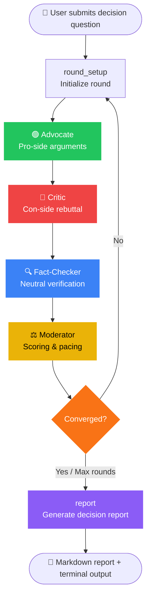
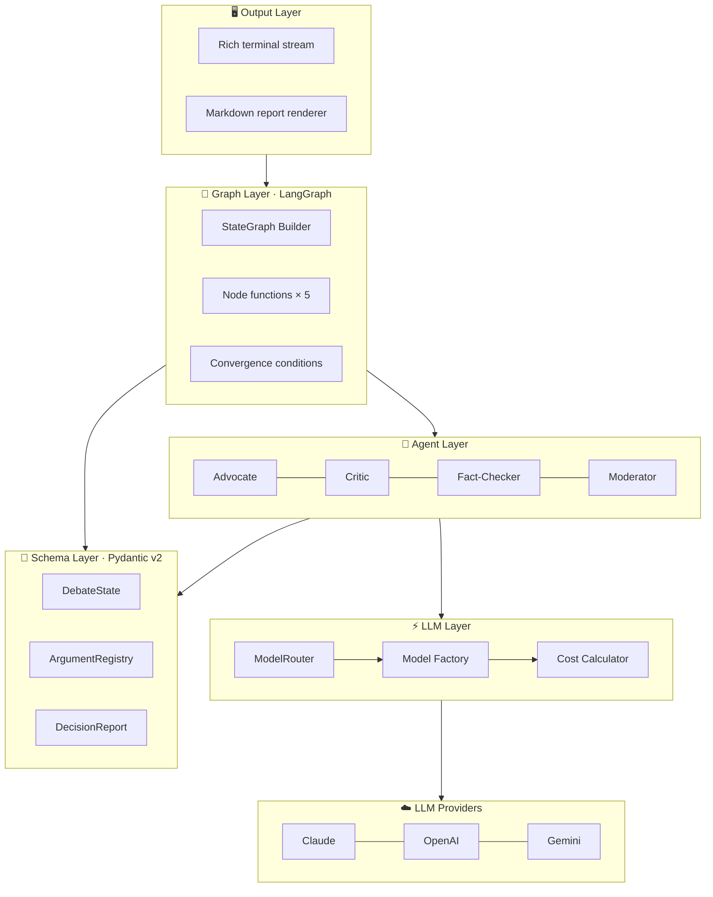

[中文](README.md) | **English**

# Multi-Agent Debate-Driven Decision Engine (Python)

A production-ready multi-agent debate system built on **LangGraph + LangChain Core + Pydantic v2**.

---

## Core Architecture

### Debate Flow (LangGraph State Graph)



### System Layer Architecture



### Agent Roles

| Agent | Responsibility | Color |
|-------|---------------|-------|
| **Advocate** | Builds the strongest pro-side case with arguments and evidence | 🟢 Green |
| **Critic** | Systematically challenges pro arguments, raises counterpoints | 🔴 Red |
| **Fact-Checker** | Neutrally audits argument quality, flags logical fallacies | 🔵 Blue |
| **Moderator** | Controls debate pace, computes convergence score, decides termination | 🟡 Yellow |

---

## Tech Stack

- **Python 3.12+** (async/await throughout)
- **LangGraph** — Stateful directed graph: `round_setup → advocate → critic → fact_checker → moderator → (loop or report)`
- **LangChain Core** — `BaseChatModel` + `with_structured_output()`, unified multi-provider abstraction
- **Pydantic v2** — All Agent inputs/outputs strictly validated
- **Multi-provider** — Claude / OpenAI / Gemini, configurable per Agent role

---

## Quick Start

### Option A: Docker (Recommended)

```bash
cd debate-engine-py
cp .env.example .env          # fill in your API Key 
                              #If you choose the API not form Claude do NOT forget the config.yaml
docker-compose run --rm debate "Should we migrate our Java services to Go?"
```

Interactive mode (start container, then run multiple debates):

```bash
docker-compose run --rm debate bash
python -m src.main "Build vs. Buy analytics platform?"
```

### Option B: Local Python

```bash
python -m venv .venv && source .venv/bin/activate
pip install -e ".[dev]"
cp .env.example .env           # fill in ANTHROPIC_API_KEY / OPENAI_API_KEY / GOOGLE_API_KEY
python -m src.main "Decision question"
```

### Option C: CLI One-Shot

```bash
python -m src.main "Decision question" "Optional context (team size, budget, constraints, etc.)"
```

---

## Terminal Output

Built with [Rich](https://github.com/Textualize/rich):

- 🟢 Advocate (green) / 🔴 Critic (red) / 🟡 Fact-Checker (yellow) / 🔵 Moderator (cyan) — color-coded role panels
- Full argument content: `claim` + `reasoning` + `evidence`
- Fact-check icons: ✅ valid / ❌ flawed / ⚠️ needs_context / ❓ unverifiable
- Moderator convergence progress bar: `[████████░░░░░░░░░░░░] 40%`
- Debate termination reason at end

---

## Report Output Format

After debate completion, the Markdown report is automatically saved to `reports/debate-report.md` using a **two-part structure**:

**Part 1: Full Debate Transcript** — complete per-round output from every agent:
- 🟢 Advocate / 🔴 Critic: arguments (reasoning + evidence), rebuttals, concessions, confidence shift
- 🔍 Fact-Checker: per-argument verdicts (✅/❌/⚠️/❓) and overall assessment
- ⚖️ Moderator: round summary, key divergences, convergence progress bar, next-round focus
- Debate termination status and reason

**Part 2: Summary Analysis** — structured decision report including: executive summary, recommendation (with confidence), surviving pro/con arguments, resolved/unresolved disagreements, risk factors, next steps, and debate statistics.

---

## Configuration

### .env

```env
ANTHROPIC_API_KEY=sk-ant-api03-...
# OPENAI_API_KEY=sk-proj-...
# GOOGLE_API_KEY=AIza...
```

### config.yaml

```yaml
debate:
  max_rounds: 5               # hard cap on debate rounds
  convergence_threshold: 0.8  # consecutive high-convergence terminates early
  language: en                # zh → Chinese output | en → English output

models:
  default:
    provider: claude           # claude | openai | gemini
    model_name: claude-sonnet-4-5
    temperature: 0.7
```

---

## Project Structure

```
debate-engine-py/
├── config.yaml                          # Main config
├── pyproject.toml                       # Dependencies + packaging
├── Dockerfile / docker-compose.yml      # Container setup
│
├── src/
│   ├── main.py                          # Entry point + run_debate() API
│   ├── agents/                          # Advocate · Critic · FactChecker · Moderator
│   ├── core/                            # ArgumentRegistry · TranscriptManager
│   ├── graph/                           # LangGraph builder · conditions · nodes/
│   ├── llm/                             # ModelRouter · factory · cost
│   ├── output/                          # Markdown renderer · CLI stream
│   ├── prompts/                         # Prompt construction per Agent
│   └── schemas/                         # Pydantic v2 models (arguments, agents, debate, report)
│
├── examples/
│   ├── build_vs_buy.py
│   └── java_to_go.py
│
├── skills/                              # Adversarial debate Skill documentation
│   └── adversarial-debate/              # Portable Skill (Agent defs, schemas, integration guide)
│       ├── SKILL.md
│       ├── 01-identity.md
│       ├── 02-protocol.md
│       ├── 03-prompts.md
│       ├── 04-schemas.md
│       ├── 05-registry.md
│       ├── 06-integration.md
│       └── 07-config.md
│
├── SKILL_adversarial_debate.md          # Top-level adversarial debate Skill entry doc
│
└── tests/                               # 18 cases, all async-safe
```

---

## Tests

```bash
pip install -e ".[dev]"
pytest
pytest -v --tb=short
```

18 test cases across 4 modules — all pass.

---

## Advanced Usage

### Programmatic Calling

```python
import asyncio
from src.main import load_config, run_debate
from src.output.renderer import render_report_to_markdown

async def main():
    config = load_config("config.yaml")
    state = await run_debate(
        question="Should we rewrite our billing system from Rails to Go?",
        config=config,
        context="6-person team, Q3 deadline, ~$200K budget",
    )
    if state.final_report:
        md = render_report_to_markdown(state.final_report, state)
        import os
        os.makedirs("reports", exist_ok=True)
        with open("reports/debate-report.md", "w", encoding="utf-8") as f:
            f.write(md)
        print("Report saved to reports/debate-report.md")

asyncio.run(main())
```

### Mixed Provider Mode

```yaml
# config.yaml — different model per Agent role
models:
  advocate:
    provider: openai
    model_name: gpt-4o
  critic:
    provider: claude
    model_name: claude-sonnet-4-5
  fact_checker:
    provider: gemini
    model_name: gemini-2.0-flash
  moderator:
    provider: claude
    model_name: claude-opus-4-5
```

### Accessing Debate History

```python
# After run_debate() returns state:
registry = state.argument_registry
active_args = registry.get_active_arguments()       # all surviving arguments
stats = registry.get_survivor_stats()               # survival rate stats

# Transcript
for rnd in state.rounds:
    print(f"Round {rnd.round_number}: convergence {rnd.convergence_score:.2f}")
```

---

## FAQ

**Q: How do I change the number of debate rounds?**
Set `debate.max_rounds` in `config.yaml`. Alternatively, if convergence is reached early (2 consecutive rounds with score ≥ 0.8) the debate ends automatically.

**Q: Docker can't find the API Key?**
Make sure `.env` is in the same directory as `docker-compose.yml`, and `docker-compose.yml` includes `env_file: .env`.

**Q: Does it work offline / without internet?**
No. It calls external LLM APIs and requires an internet connection.

**Q: How do I reduce API costs?**
Use a faster/cheaper model for the Fact-Checker or Moderator (e.g. `gemini-2.0-flash`) and reserve the expensive model for Advocate/Critic only.

**Q: Can it use providers other than Claude/OpenAI/Gemini?**
Yes, any LangChain-compatible `BaseChatModel` works. Add the provider in `src/llm/factory.py`.

---

## Performance

| Scenario | Rounds | LLM Calls | Approx. Cost |
|----------|--------|-----------|--------------|
| Simple decision (clear position) | 2–3 | ~9–13 | ~$0.10–$0.20 |
| Complex decision (multi-factor) | 4–5 | ~17–21 | ~$0.30–$0.50 |
| Cost-optimized (Gemini Flash) | 3–4 | ~13–17 | ~$0.02–$0.05 |

*(Based on Claude Sonnet pricing; Gemini Flash is approximately 10× cheaper)*

---

## License

MIT — contributions welcome.
